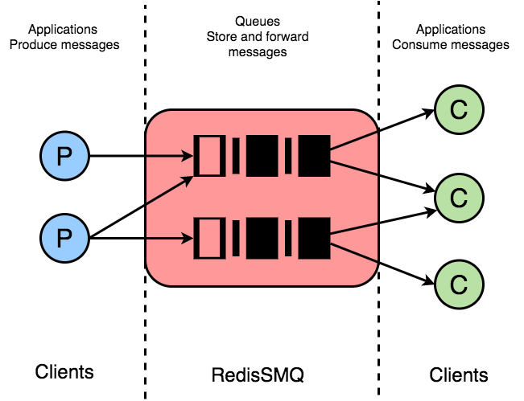

<div align="center" style="text-align: center">
  <p><a href="https://github.com/weyoss/redis-smq"></a></p>
  <p>A simple high-performance Redis message queue for Node.js.</p>
  <p>
    <a href="https://github.com/weyoss/redis-smq/actions/workflows/tests.yml"></a>
    <a href="https://coveralls.io/r/weyoss/redis-smq?branch=master" rel="nofollow"></a>
    <a href="https://npmjs.org/package/redis-smq" rel="nofollow"></a>
    <a href="https://npmjs.org/package/redis-smq" rel="nofollow"></a>
    <a href="https://lgtm.com/projects/g/weyoss/redis-smq/context:javascript" rel="nofollow"></a>
  </p>
</div>

RedisSMQ is a Node.js library for queuing messages (aka jobs) and processing them asynchronously with consumers. Backed by Redis, it allows scaling up your application with ease of use.

## Features

* **[High-performance message processing](docs/performance.md)**
* **[Multi-Queue Producers](#producer-class) & [Multi-Queue Consumers](#consumer-class)**: Offering very flexible models which make RedisSMQ an ideal message broker for your microservices. 
* **[Supporting both at-least-once/at-most-once delivery](/docs/api/message.md#messageprototypesetretrythreshold)**: In case of failures, while delivering or processing a message, RedisSMQ can guaranty that the message will be not lost and redelivered again. When configured to do so, RedisSMQ can also ensure that the message is delivered at-most-once.
* **[Message Expiration](docs/api/message.md#messageprototypesetttl)**: A message will not be delivered if it has been in a queue for longer than a given amount of time, called TTL (time-to-live).
* **[Message Consumption Timeout](docs/api/message.md#messageprototypesetconsumetimeout)**: Timeout for consuming messages.
* **[Queue Rate Limiting](docs/queue-rate-limiting.md)**: Allowing you to control the rate at which the messages are consumed from a given queue.
* **[Scheduling Messages](docs/scheduling-messages.md)**: Messages can be configured to be delayed, delivered for N times with an optional period between deliveries, and to be scheduled using CRON expressions.
* **[Reliable Priority Queues](docs/priority-queues.md)**: Supports priority messaging.
* **[Multiplexing](docs/multiplexing.md)**: A feature which allows message handlers to use a single redis connection to dequeue and consume messages.  
* **[HTTP API](docs/http-api.md)**: an HTTP interface is provided to interact with the MQ.
* **[Web UI](docs/web-ui.md)**: RedisSMQ can be managed also from your web browser.
* **[Logging](docs/logs.md)**: Comes with a built-in JSON logger. But you can also use your own logger instance.
* **[Configurable](docs/configuration.md)**: Many options and features can be configured.
* **Both redis & ioredis clients are supported**: RedisSMQ can be configured to use either `redis` or `ioredis` to connect to Redis server.
* **Rigorously tested**: With 100+ tests and code coverage no less than 80%.
* **Highly optimized**: Strongly-typed and implemented using pure callbacks, with small memory footprint and no memory leaks. See [callbacks vs promises vs async/await benchmarks](http://bluebirdjs.com/docs/benchmarks.html).


### RedisSMQ Use Case: Multi-Queue Producers & Multi-Queue Consumers

&nbsp;



## Table of Content

1. [What's new?](#whats-new)
2. [Installation](#installation)
3. [Configuration](#configuration)
4. [Usage](#usage)
   1. Basics
       1. [Message Class](#message-class)
       2. [Producer Class](#producer-class)
       3. [Consumer Class](#consumer-class)
   2. Advanced Topics
      1. [Scheduling Messages](docs/scheduling-messages.md)
      2. [Priority Queues](docs/priority-queues.md)
      3. [Queue Rate Limiting](docs/queue-rate-limiting.md)
      4. [Multiplexing](docs/multiplexing.md)
      5. [Message Manager](docs/api/message-manager.md)
      6. [Queue Manager](docs/api/queue-manager.md)
      7. [HTTP API](docs/http-api.md)
      8. [Web UI](docs/web-ui.md)
      9. [Logs](docs/logs.md)
5. [RedisSMQ Architecture](docs/redis-smq-architecture.md)
6. [Performance](#performance)
7. [Contributing](#contributing)
8. [License](#license)

## What's new?

**2022.05.13**

:rocket: Release 7.0.0-rc.0 is ready! The RedisSMQ v7 is a refinement release with many improvements toward making 
things more simple to use and removing any confusions that can occur while working with the message queue. If you are 
upgrading your installation, take a look at the [migration guide](docs/migrating-from-v6-to-v7.md).

## Installation

```text
npm install redis-smq --save
```

Considerations:

- RedisSMQ is targeted to be used in production environments. Therefore, only active LTS and maintenance LTS Node.js releases (v12, v14, and v16) are supported. The latest stable Node.js version is recommended.
- Minimal Redis server version is 2.6.12. The latest stable Redis version is recommended.

## Configuration

See [Configuration](docs/configuration.md) for more details.

## Usage

Before producing/consuming a message to/from a queue, make sure that such queue exists. 

You can create a queue, view existing queues, or delete a queue using the [QueueManager](/docs/api/queue-manager.md).

```javascript
const { QueueManager } = require('redis-smq');

QueueManager.getSingletonInstance((err, queueManager) => {
  if (err) console.log(err);
  else queueManager.queue.create('test_queue', false, (err) => console.log(err));
})
```

### Basics

RedisSMQ provides 3 classes in order to work with the message queue: `Message`, `Producer`, and `Consumer`.

#### Message Class

`Message` class is responsible for creating messages that may be published. 

A message can carry your application data, sometimes referred to as `message payload`, which may be delivered to a consumer to be processed asynchronously.  

The message payload can be of any valid JSON data type. It may be a simple text message like `Hello world` or a complex data type like `{hello: 'world'}`.

```javascript
const { Message } = require('redis-smq');
const message = new Message();
message
    .setBody({hello: 'world'})
    .setTTL(3600000) // in millis
    .setQueue('test_queue');
```

The `Message` class provides many methods for setting up different message parameters such as message body, message priority, message TTL, etc. 

See [Message Reference](docs/api/message.md) for more details.

#### Producer Class

`Producer` class allows you to publish a message to a queue. 

You can use a single `Producer` instance to produce messages, including messages with priority, to multiple queues.

Before publishing a message do not forget to set the destination queue of the message using the [setQueue()](/docs/api/message.md#messageprototypesetqueue) method, otherwise an error will be returned.

```javascript
'use strict';
const {Message, Producer} = require('redis-smq');

const message = new Message();

message
    .setBody({hello: 'world'})
    .setTTL(3600000) // in millis
    .setQueue('test_queue');

message.getId() // null

const producer = new Producer();
producer.produce(message, (err) => {
    if (err) console.log(err);
    else {
      const msgId = message.getId(); // string
      console.log('Successfully produced. Message ID is ', msgId);
    }
});
```

See [Producer Reference](docs/api/producer.md) for more details.

#### Consumer Class

`Consumer` class can be used to receive and consume messages from a queue.

Similarly to a `Producer` instance, a `Consumer` instance can consume messages from multiple queues.

For consuming messages from a queue, the `Consumer` class provides the [consume()](/docs/api/consumer.md#consumerprototypeconsume) method which allows you to register a `message handler`. 

A `message handler` is a function which get called once a message is received. 

Message handlers can be registered at any time, before or after you have started your consumer. 

A consumer can be started using the [run()](/docs/api/consumer.md#consumerprototyperun) method.

To shut down and remove a given `message handler` from your consumer, use the [cancel()](/docs/api/consumer.md#consumerprototypecancel) method. 

To shut down completely your consumer and tear down all message handlers, use the [shutdown()](/docs/api/consumer.md#consumerprototypeshutdown) method.

```javascript
'use strict';

const { Consumer } = require('redis-smq');

const consumer = new Consumer();

const messageHandler = (msg, cb) => {
   const payload = msg.getBody();
   console.log('Message payload', payload);
   cb(); // acknowledging the message
};

consumer.consume('test_queue', messageHandler, (err) => {
   if (err) console.error(err);
});

consumer.run();
```

Once a message is received, to acknowledge it, you invoke the callback function without arguments, as shown in the example above. 

Message acknowledgment informs the MQ that a message has been successfully consumed.

If an error occurred while processing a message, you can unacknowledge the message by passing the error to the callback function.

By default, unacknowledged messages are re-queued and delivered again unless **message retry threshold** is exceeded. Then the messages are moved to a **dead-letter queue (DLQ)**. 

A `dead-letter queue` is a system generated queue that holds all messages that couldn't be processed or can not be delivered to consumers.

By default, RedisSMQ does not store acknowledged and dead-lettered messages for saving disk and memory space, and also to increase message processing performance. If you need such feature, you can enable it from your [configuration](/docs/configuration.md) object.

See [Consumer Reference](docs/api/consumer.md) for more details.

### Advanced Topics

* [Scheduling Messages](docs/scheduling-messages.md)

* [Priority Queues](docs/priority-queues.md)

* [Queue Rate Limiting](docs/queue-rate-limiting.md)

* [Multiplexing](docs/multiplexing.md)
  
* [Message Manager](docs/api/message-manager.md)

* [Queue Manager](docs/api/queue-manager.md)

* [HTTP API](docs/http-api.md)

* [Web UI](docs/web-ui.md)

* [Logs](docs/logs.md)

## RedisSMQ Architecture

* See [Architecture Overview](docs/redis-smq-architecture.md).

## Performance

See [Performance](docs/performance.md) for more details.

## Contributing

So you are interested in contributing to this project? Please see [CONTRIBUTING.md](https://github.com/weyoss/guidelines/blob/master/CONTRIBUTIONS.md).

## License

[MIT](https://github.com/weyoss/redis-smq/blob/master/LICENSE)
