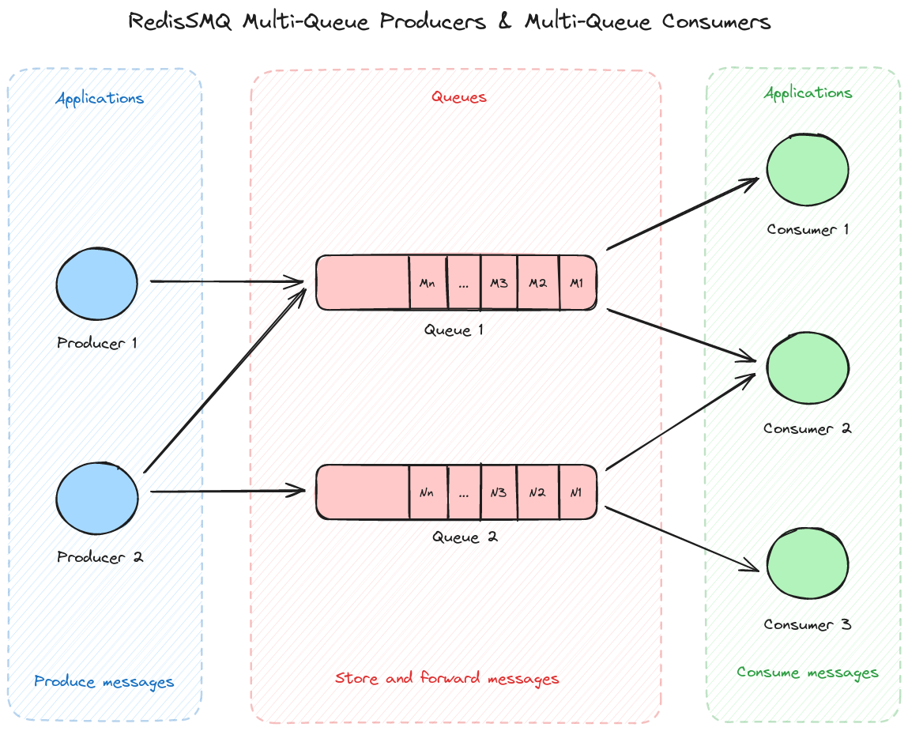

> [!IMPORTANT]
> Currently, RedisSMQ is going under heavy development. Pre-releases at any time may introduce new commits with breaking changes. 
> The master branch always reflects the most recent changes. To view the latest release reference see [RedisSMQ v7.2.3](https://github.com/weyoss/redis-smq/tree/v7.2.3)

<div align="center" style="text-align: center">
  <p><a href="https://github.com/weyoss/redis-smq"></a></p>
  <p>A simple high-performance Redis message queue for Node.js.</p>
</div>

# RedisSMQ

<p>
   <a href="https://github.com/weyoss/redis-smq/actions/workflows/tests.yml"></a>
   <a href="https://github.com/weyoss/redis-smq/actions/workflows/codeql.yml" rel="nofollow"></a>
   <a href="https://codecov.io/github/weyoss/redis-smq?branch=master" rel="nofollow"></a>
   <a href="https://npmjs.org/package/redis-smq" rel="nofollow"></a>
   <a href="https://npmjs.org/package/redis-smq" rel="nofollow"></a>
</p>

RedisSMQ is a Node.js library for queuing messages (aka jobs) and processing them asynchronously with consumers. Backed by Redis, it allows scaling up your application with ease of use.

## Features

* [High-performance message processing](docs/performance.md).
* Flexible Producer/Consumer model which offers [Multi-Queue Producers](docs/producing-messages.md) & [Multi-Queue Consumers](docs/consuming-messages.md), focuses on simplicity and without tons of features. This makes RedisSMQ an ideal message broker for microservices-based applications.
* In case of failures, while delivering or processing a message, RedisSMQ can guaranty that the message is not lost and that it is redelivered [at-least-once](docs/api/classes/ProducibleMessage.md#setretrythreshold). When configured to do so, RedisSMQ can also ensure that the message is delivered [at-most-once](docs/api/classes/ProducibleMessage.md#setretrythreshold).
* RedisSMQ offers different exchange types: [Direct Exchange](docs/message-exchanges.md#direct-exchange), [Topic Exchange](docs/message-exchanges.md#topic-exchange), and [FanOut Exchange](docs/message-exchanges.md#fanout-exchange) for publishing a message to one or multiple queues.
* 3 queuing strategies that you may use depending on your needs and requirements: [FIFO queues, LIFO queues, and Reliable Priority Queues](docs/queues.md).
* A message can be [set to expire](docs/api/classes/ProducibleMessage.md#setttl) if it has not been delivered within a given amount of time. [Consumption timeout](docs/api/classes/ProducibleMessage.md#setconsumetimeout) allows canceling a message consumption if a consumer did not acknowledge the message for a period of time.
* [Queue Rate Limiting](docs/queue-rate-limiting.md) which allows to control the rate at which the messages are consumed from a given queue.
* Builtin [message scheduler](docs/scheduling-messages.md) allowing to delay a message, to deliver a message for N times with an optional period between deliveries, or simply to schedule message delivery using CRON expressions.
* [Multiplexing](/docs/multiplexing.md): A feature which allows message handlers to use a single redis connection to dequeue and consume messages.
* An [HTTP interface](https://github.com/weyoss/redis-smq-monitor) is provided to interact with the MQ. RedisSMQ can be managed also from your [web browser](https://github.com/weyoss/redis-smq-monitor-client).
* Depending on [your preferences](docs/configuration.md), RedisSMQ can use either [node-redis v3](https://github.com/redis/node-redis/tree/v3.1.2), [node-redis v4](https://github.com/redis/node-redis), or [ioredis](https://github.com/luin/ioredis).
* RedisSMQ is [highly optimized](https://lgtm.com/projects/g/weyoss/redis-smq/context:javascript), implemented using pure callbacks, with small memory footprint and no memory leaks. See [Callback vs Promise vs Async/Await benchmarks](https://gist.github.com/weyoss/24f9ecbda175d943a48cb7ec38bde821).
* [Both ESM & CJS modules are supported](docs/esm-cjs-modules.md).

## RedisSMQ Use Case: Multi-Queue Producers & Multi-Queue Consumers



## What's new?

:rocket: RedisSMQ v8 is coming soon!

## Installation

```shell
npm i redis-smq@rc
```

Considerations:

- Minimal Node.js version is >= 18 (RedisSMQ is tested under current active LTS and maintenance LTS Node.js releases).
- Minimal Redis server version is 4.0.0.

## Usage

RedisSMQ provides 3 classes in order to work with the message queue: `ProducibleMessage`, `Producer`, and `Consumer`.

Producers and consumers exchange data using one or multiple queues that may be created using the [Queue Class](docs/api/classes/Queue.md).

A queue is responsible for holding messages which are produced by producers and are delivered to consumers.

### Creating a queue

```javascript
const { Queue, EQueueType } = require('redis-smq');

const queue = new Queue();

// Creating a LIFO queue
queue.save('my_queue', EQueueType.LIFO_QUEUE, (err) => console.log(err));
```

### Producing a message

```javascript
const { Producer, ProducibleMessage } = require('redis-smq');

const producer = new Producer();

const msg = new ProducibleMessage();
msg.setQueue('my_queue').setBody('Hello Word!')

producer.produce(msg, (err) => console.log(err));
```

### Consuming a message

```javascript
const { Consumer } = require('redis-smq');

const consumer = new Consumer();
const messageHandler = (msg, cb) => {
  console.log(msg.getBody());
  cb();
}
consumer.consume('my_queue', messageHandler, (err) => console.log(err));
```

## Documentation

See [RedisSMQ Docs](docs/README.md) for more details.

## Contributing

So you are interested in contributing to this project? Please see [CONTRIBUTING.md](https://github.com/weyoss/guidelines/blob/master/CONTRIBUTIONS.md).

## License

[MIT](https://github.com/weyoss/redis-smq/blob/master/LICENSE)
