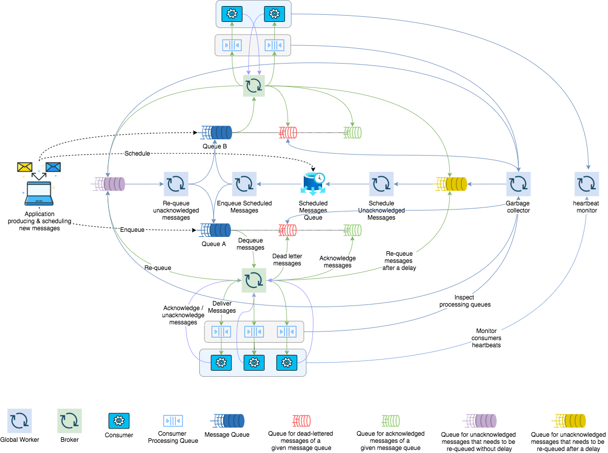

<div align="center" style="text-align: center">
  <p></p>
  <p>A simple high-performance Redis message queue for Node.js.</p>
  <p>
    <a href="https://github.com/weyoss/redis-smq/actions/workflows/tests.yml"></a>
    <a href="https://coveralls.io/r/weyoss/redis-smq?branch=master" rel="nofollow"></a>
    <a href="https://npmjs.org/package/redis-smq" rel="nofollow"></a>
    <a href="https://npmjs.org/package/redis-smq" rel="nofollow"></a>
    <a href="https://lgtm.com/projects/g/weyoss/redis-smq/context:javascript" rel="nofollow"></a>
  </p>
</div>

RedisSMQ is a Node.js library for queuing messages (aka jobs) and processing them asynchronously with consumers. Backed 
by Redis, it allows scaling up your application with ease of use.

For more details about initial RedisSMQ design and the motivation behind it see [https://medium.com/@weyoss/building-a-simple-message-queue-using-redis-server-and-node-js-964eda240a2a](https://medium.com/@weyoss/building-a-simple-message-queue-using-redis-server-and-node-js-964eda240a2a)

## Current MQ Architecture Overview

High-level overview of how RedisSMQ works:

- An application publishes messages using a producer.
- Consumers pull messages off queues and start processing.
- If an error occurs, messages are unacknowledged. Otherwise, once acknowledged, messages are moved to the `acknowledged queue`.
- Unacknowledged messages are re-queued with optional `retryDelay`. When `retryThreshold` is exceeded, messages are put in the `deal-letter queue`.

&nbsp;



## Features

 * **[High-performance message processing](docs/performance.md)**
 * **Scalable**: A queue can be consumed by multiple concurrent consumers, running on different hosts.
 * **Persistent**: Messages are not lost in case of consumer failures.
 * **Atomic**: A message can be delivered only to one consumer at a time.
 * **[Message expiration](docs/api/message.md#messageprototypesetttl)**: A message will not be delivered if it has been in a queue for longer 
 than a given amount of time, called TTL (time-to-live).
 * **[Message consume timeout](docs/api/message.md#messageprototypesetconsumetimeout)**: Timeout for a consumer to consume a message.
 * **[Delaying and scheduling message delivery](docs/scheduling-messages.md)**: Messages can be configured to be delayed, delivered 
   for N times with an optional period between deliveries, and to be scheduled using CRON expressions.
 * **[Reliable Priority Queues](docs/priority-queues.md)**: Supports priority messaging.
 * **[HTTP API](docs/http-api.md)**: an HTTP interface is provided to interact with the MQ.
 * **[Web UI](docs/web-ui.md)**: Using the Web UI you can monitor and manage the MQ is real-time.
 * **[JSON Logging](docs/logs.md)**: Supports JSON log format for troubleshooting and debugging.
 * **Highly optimized**: Implemented using pure callbacks, with small memory footprint and no memory leaks. See [callbacks vs promises vs async/await benchmarks](http://bluebirdjs.com/docs/benchmarks.html).
 * **[Configurable](docs/configuration.md)**: Many options and features can be configured.
 * **Rigorously tested**: With 100+ tests and code coverage no less than 80%.
 * **Supports both redis & ioredis**: RedisSMQ can be configured to use either `redis` or `ioredis` 
 to connect to Redis server.  

## Table of content

1. [What's new?](#whats-new)
2. [Installation](#installation)
3. [Configuration](#configuration)
4. [Usage](#usage)
   1. Basics
       1. [Message Class](#message-class)
       2. [Producer Class](#producer-class)
       3. [Consumer Class](#consumer-class)
   2. Advanced Topics
      1. [MultiQueueProducer](docs/api/multi-queue-producer.md)
      2. [Scheduling Messages](docs/scheduling-messages.md)
      3. [Priority Queues](docs/priority-queues.md)
      4. [Message Manager](docs/api/message-manager.md)
      5. [Queue Manager](docs/api/queue-manager.md)
      6. [HTTP API](docs/http-api.md)
      7. [Web UI](docs/web-ui.md)
      8. [Logs](docs/logs.md)
5. [Performance](#performance)
6. [Contributing](#contributing)
7. [License](#license)

## What's new?

**2022.01.03**

- Release v6 is almost ready. This release includes new features such as multi-queue producers, rates time series, 
complete integration with the Web UI, as well as many improvements and bug fixes. If you are upgrading your 
installation, take a look at the [migration guide](docs/migrating-from-v5-to-v6.md) before proceeding.

**2021.11.22**

- Starting with RedisSMQ v5, you can now manage your queues and messages from the Web UI. Also, many changes and improvements 
has been made, allowing for better user experience and system stability. 

See [CHANGELOG](CHANGELOG.md) for more details.

## Installation

```text
npm install redis-smq --save
```

Considerations:

- RedisSMQ is targeted to be used in production environments. Therefore, only active LTS and maintenance LTS Node.js 
  releases (v12, v14, and v16) are supported. The latest stable Node.js version is recommended.
- Minimal Redis server version is 2.6.12. The latest stable Redis version is recommended.

## Configuration

See [Configuration](docs/configuration.md) for more details.

## Usage

### Basics

RedisSMQ provides 3 classes: `Message`, `Producer`, and `Consumer` in order to work with the message queue.

#### Message Class

`Message` class is responsible for creating and manipulating messages.

```javascript
const { Message } = require('redis-smq');
const message = new Message();
message
    .setBody({hello: 'world'})
    .setTTL(3600000); // in millis

let messageTTL = message.getTTL();
```

See [Message Reference](docs/api/message.md) for more details.

#### Producer Class

`Producer` class is in turn responsible for publishing messages. Each `Producer` instance is associated with a message 
queue and provides the `produce()` method to publish a message.

```javascript
// filename: ./examples/javascript/ns1-test-queue-producer.js

'use strict';
const {Message, Producer} = require('redis-smq');

const message = new Message();

message
    .setBody({hello: 'world'})
    .setTTL(3600000);

const producer = new Producer('test_queue');
producer.produce(message, (err) => {
    if (err) console.log(err);
    else console.log('Successfully produced')
});
```

See [Producer Reference](docs/api/producer.md) for more details.

RedisSMQ also provides [MultiQueueProducer](docs/api/multi-queue-producer.md) for publishing messages to multiple 
queues from a single producer.

#### Consumer Class

The `Consumer` class is the parent class for all your consumers, which are required to implement the abstract method 
`consume()` from the parent class. 

Once a message is received, the `consume()` method get invoked with the received message as its first argument. 

In a typical scenario, consumers are saved per files, so that each file represents a consumer, which can be started 
from CLI as shown in the example bellow.

```javascript
// filename: ./examples/javascript/ns1-test-queue-consumer.js
'use strict';

const { Consumer } = require('redis-smq');

class TestQueueConsumer extends Consumer {
    consume(message, cb) {
        console.log('Got a message to consume:', message);
        cb();
    }
}

const consumer = new TestQueueConsumer('test_queue');
consumer.run();
```

Starting a consumer:

```text
$ node ./examples/javascript/test-queue-consumer.js
```

To acknowledge a received message, you invoke the callback function without arguments. 

The message acknowledgment informs the MQ that the message has been successfully consumed.

If an error occurred, the message is unacknowledged by passing the error to the callback function.

By default, unacknowledged messages are re-queued and delivered again unless **message retry threshold** is exceeded. 
Then the messages are moved to **dead-letter queue (DLQ)**. 

Each message queue has a system generated corresponding queue called `dead-letter queue` that holds all messages 
that couldn't be processed or can not be delivered to consumers.

See [Consumer Reference](docs/api/consumer.md) for more details.

### Advanced Topics

* [MultiQueueProducer](docs/api/multi-queue-producer.md)

* [Scheduling Messages](docs/scheduling-messages.md)

* [Priority Queues](docs/priority-queues.md)
  
* [Message Manager](docs/api/message-manager.md)

* [Queue Manager](docs/api/queue-manager.md)

* [HTTP API](docs/http-api.md)

* [Web UI](docs/web-ui.md)

* [Logs](docs/logs.md)

## Performance

See [Performance](docs/performance.md) for more details.

## Contributing

So you are interested in contributing to this project? Please see [CONTRIBUTING.md](https://github.com/weyoss/guidelines/blob/master/CONTRIBUTIONS.md).

## License

[MIT](https://github.com/weyoss/redis-smq/blob/master/LICENSE)