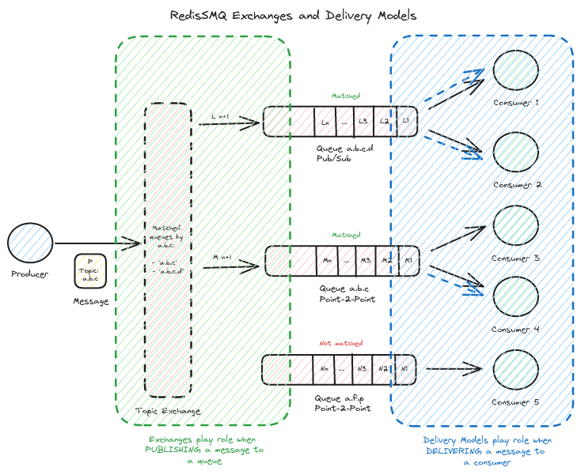

[RedisSMQ](../README.md) / [Docs](README.md) / Exchanges and Delivery Models

# Exchanges and Delivery Models

## Introduction

Message exchanges and queue delivery models are two distinct concepts that are often confused with one another. This 
section aims to clarify the differences between them and explore how they can be combined to create complex publishing 
and delivering models.

## Message Exchanges

[Message Exchanges](message-exchanges.md) enable the publication of a message to one or multiple queues based on the exchange configuration. 
This allows for flexible and dynamic routing of messages to various queues, catering to different application needs.

## Queue Delivery Models

In contrast, [Queue Delivery Models](queue-delivery-models.md) govern how messages are delivered to consumers of a given queue. They determine 
whether a message is delivered to a single consumer or to all consumers of the queue, ensuring that messages are 
processed efficiently and effectively.

## Combining Exchanges and Delivery Models

By combining message exchanges and queue delivery models, developers can create sophisticated publishing and delivering 
models that cater to specific application requirements. This synergy enables the creation of complex workflows, where 
messages are routed and delivered based on various criteria, such as message content, consumer availability, and queue 
capacity.
