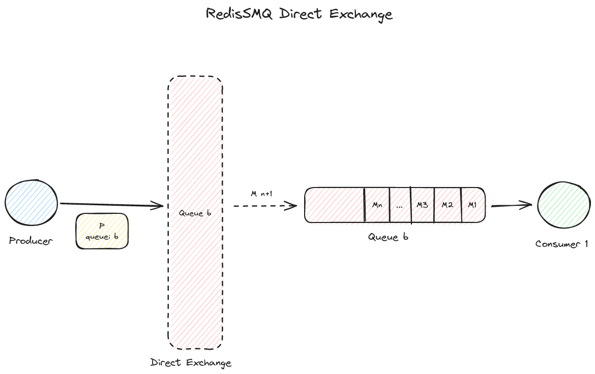
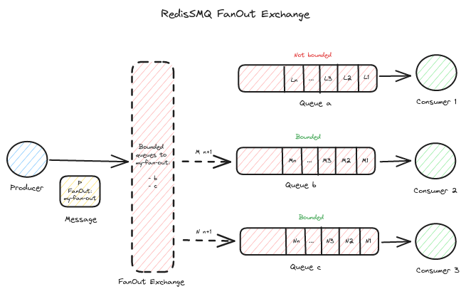

[RedisSMQ](../README.md) / [Docs](README.md) / Message Exchanges

# Message Exchanges

Starting with v7.1.0, message exchanges offer different ways to route a message to one or multiple queues.

A message exchange is like an address or a routing algorithm which decides to which queues the message should go.

Unlike other message queues, where messages are published first to an exchange, message exchanges in RedisSMQ do not store messages.

Each message is required to have a `message exchange` which is used by the producer to retrieve the list of queues that matches the exchange parameters.

From then, the producer **directly** publishes the message to the matched queues.

When a message is published to multiple queues, for each queue a new message is created with the same properties as the base message but with a new ID.

For a given message exchange, all messages that were created and published to multiple queues have the same `Exchange Tag`.

An `Exchange tag` is a unique string property that is used to keep track of all messages that was published to the list of matched queues at the time when published a message.

Out-of-box RedisSMQ offers 3 exchange types.

## Direct Exchange



A direct exchange allows producers to publish a message to a single queue which is matched exactly by the specified queue of the exchange.

The queue of the direct exchange may be a string, like `a.b.c.d` or an object describing the namespace of the queue like `{ ns: 'my-app', name: 'a.b.c.d'}`.

If a string is used for the direct exchange queue then the **default** namespace will be used.

A direct exchange with the queue `a.b.c.d` matches exactly the queue with the name `a.b.c.d`.

### Usage

To set up a Direct exchange (a queue) for a given message the  [ProducibleMessage Class](api/classes/ProducibleMessage.md) provides [ProducibleMessage.setQueue()](api/classes/ProducibleMessage.md#setqueue).

```typescript
const { ProducibleMessage } = require('redis-smq');

const msg = new ProducibleMessage();
msg.setQueue('a.b.c.d').setBody('123456789');
```

When publishing a message with a direct exchange, if the exchange queue does not exist the message will be discarded and an error will be returned.

To get the list of matched queues for a given message with a direct exchange use [ExchangeDirect.getQueues()](api/classes/ExchangeDirect.md#getqueues).

For more details see:

- [ExchangeDirect Class](api/classes/ExchangeDirect.md)

## Topic Exchange


When a topic exchange is used for a message, it allows to publish the message to one or multiple queues which are matched by the topic pattern of the exchange.

The pattern of a topic exchange is a string which is composed of alphanumeric characters, including `-` and `_` characters, that are separated by a `.`.

The `a.b.c.d` topic pattern matches the following queues `a.b.c.d`, `a.b.c.d.e`, and `a.b.c.d.e.f`, but it does not match the `a.b`, `a.b.c`, or `a.b.c.z` queues.

A topic pattern may be also an object describing the namespace of the topic.

For example the topic `{ ns: 'my-app', topic: 'a.b.c.d'}` will match all queues which satisfy the pattern `a.b.c.d` from the namespace `my-app`.

When a namespace is not provided the default namespace will be used.

### Usage

To set up a Topic exchange (a topic) for a given message the [ProducibleMessage Class](api/classes/ProducibleMessage.md) provides [ProducibleMessage.setTopic()](api/classes/ProducibleMessage.md#settopic).

```typescript
const { ProducibleMessage } = require('redis-smq');

const msg = new ProducibleMessage();
msg.setTopic('a.b.c.d').setBody('123456789');
```

When publishing a message with a topic exchange, if the topic pattern does not match any queues the message will be discarded and an error will be returned.

To get the list of matched queues for a given message with a Topic exchange use [ExchangeTopic.getQueues()](api/classes/ExchangeTopic.md#getqueues).

For more details see:

- [ExchangeTopic Class](api/classes/ExchangeTopic.md)

## FanOut Exchange



A FanOut exchange allows producers to publish a message to one or multiple queues which are bound to this exchange by a binding key.

### Usage

In order to use a FanOut exchange you need first to create it using [ExchangeFanOut.saveExchange()](api/classes/ExchangeFanOut.md#saveexchange) and bind one or many queues to the created exchange using [ExchangeFanOut.bindQueue()](api/classes/ExchangeFanOut.md#bindqueue).

To set up a FanOut exchange for a given message the [ProducibleMessage API](api/classes/ProducibleMessage.md) provides [ProducibleMessage.setFanOut()](api/classes/ProducibleMessage.md#setfanout).

```typescript
const { ProducibleMessage } = require('redis-smq');

const msg = new ProducibleMessage();

// Assuming that my-FanOut-exchange already exists
msg.setFanOut('my-FanOut-exchange').setBody('123456789');
```

When publishing a message with a FanOut exchange, if the exchange does not exist or no queues are bound to such an exchange the message will be discarded and error will be returned.

To get the list of matched queues for a given message with a FanOut exchange use [ExchangeFanOut.getQueues()](api/classes/ExchangeFanOut.md#getqueues).

Additionally, FanOut exchanges can be also managed using the [HTTP API Interface](https://github.com/weyoss/redis-smq-monitor) or from your browser with the help of the [Web UI](https://github.com/weyoss/redis-smq-monitor-client).

For more details see:

- [ExchangeFanOut Class](api/classes/ExchangeFanOut.md)