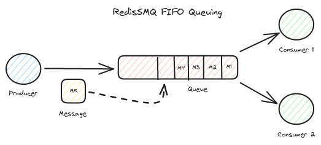
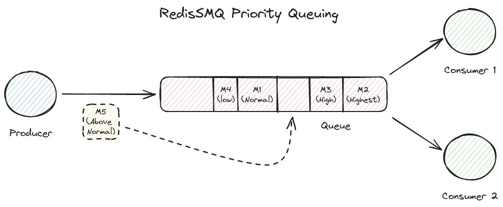

[RedisSMQ](../README.md) / [Docs](README.md) / Queues

# Queues

A queue is responsible for holding messages which are produced by producers and are delivered to consumers.

RedisSMQ supports 3 types of queues: **LIFO queues**, **FIFO queues**, and **Priority queues**.

All RedisSMQ queue types are **reliable**. A queue is said to be reliable, when during a failure scenario, let it be for example a consumer crash, it can recover from such failure and the message being processed is not lost.

In a typical use case, both LIFO and FIFO queues use [brpoplpush](https://redis.io/commands/brpoplpush), which blocks the connection to the Redis server until a message is received. However, priority queues use pooling and lua scripting which introduce a little of overhead on the MQ and therefore priority queues are less performant than other queue types.

## LIFO (Last In, First Out) queues


In a LIFO queue the last published messages are always delivered first and the first published messages are delivered last.

```javascript
const { Queue, EQueueType, EQueueDeliveryModel } = require('redis-smq');

const queue = new Queue();
queue.save(
  'my_queue',
  EQueueType.LIFO_QUEUE,
  EQueueDeliveryModel.POINT_TO_POINT,
  (err) => {
    if (err) console.error(err);
  },
);
```

See [Queue.save()](api/classes/Queue.md#save) for more details.

## FIFO (First In, First Out) Queues



In a FIFO queue the first published messages are delivered first and the last published messages are delivered last.

```javascript
const { Queue, EQueueType, EQueueDeliveryModel } = require('redis-smq');

const queue = new Queue();
queue.save(
  'my_queue',
  EQueueType.FIFO_QUEUE,
  EQueueDeliveryModel.POINT_TO_POINT,
  (err) => {
    if (err) console.error(err);
  },
);
```

See [Queue.save()](api/classes/Queue.md#save) for more details.

## Priority Queues



In a priority queue, messages with higher priority are always delivered first before messages with lower priority.

```javascript
const { Queue, EQueueType, EQueueDeliveryModel } = require('redis-smq');

const queue = new Queue();
queue.save(
  'my_queue',
  EQueueType.PRIORITY_QUEUE,
  EQueueDeliveryModel.POINT_TO_POINT,
  (err) => {
    if (err) console.error(err);
  },
);
```

See [Queue.save()](api/classes/Queue.md#save) for more details.

### Setting Up a ProducibleMessage Priority

To set up a message priority, the [ProducibleMessage Class](api/classes/ProducibleMessage.md) provides the following methods:

- [ProducibleMessage.setPriority()](api/classes/ProducibleMessage.md#setpriority)
- [ProducibleMessage.getPriority()](api/classes/ProducibleMessage.md#getpriority)

Valid message priority values that you can apply to a given message are:

- `EMessagePriority.LOWEST`
- `EMessagePriority.VERY_LOW`
- `EMessagePriority.LOW`
- `EMessagePriority.NORMAL`
- `EMessagePriority.ABOVE_NORMAL`
- `EMessagePriority.HIGH`
- `EMessagePriority.VERY_HIGH`
- `EMessagePriority.HIGHEST`

See [EMessagePriority](api/enums/EMessagePriority.md).

## Queue Namespaces

Queues in RedisSMQ are namespaced.

A queue namespace is used as a scope for a given set of queues to ensure unique queue names and to avoid **name collisions** when multiple queues share the same name.

A given queue can be either identified by a queue name like `orders` or explicitly by its queue name and namespace for example `{ ns: 'my-app', name: 'orders' }`.

By default, when a namespace for a queue is not specified, the queue is assigned to the **default** namespace.

The default namespace can be configured from your configuration object. See [Configuration](configuration.md) for more details.

## Queue Naming Requirements

A queue name is required to fulfill the following requirements:

- To be composed of alphanumeric characters `[a-z0-9]` for example `queue$` is an invalid queue name;
- May include `-` and `_` characters for example `my-queue` or `my_queue` are valid queue names;
- To start with an alpha character `[a-z]` and ends with an alphanumeric character `[a-z0-9]` for example `3queue` or `my_queue_` are invalid queue names;
- Is allowed to include dots (`.`) for denoting queues hierarchy for example `sports.football`. See [Topic Exchange](message-exchanges.md#topic-exchange);

## Managing Queues and Namespaces

Queues and Namespaces can be managed using the [Queue Class](api/classes/Queue.md) and [Namespace Class](api/classes/Namespace.md) which provide the following methods:

1. [Namespace.getNamespaces()](api/classes/Namespace.md#getnamespaces): To retrieve the list of namespaces.
2. [Namespace.getNamespaceQueues()](api/classes/Namespace.md#getnamespacequeues): To retrieve the list of queues of a given namespace.
3. [Namespace.delete()](api/classes/Namespace.md#delete): To delete a namespace alongside with its queues.
4. [Queue.save()](api/classes/Queue.md#save): To create a queue.
5. [Queue.list()](api/classes/Queue.md#getqueues): To retrieve the list of queues from all namespaces.
6. [Queue.delete()](api/classes/Queue.md#delete): To delete a queue.
7. [Queue.exists()](api/classes/Queue.md#exists): To check of a queue exists.
8. [Queue.getProperties()](api/classes/Queue.md#getproperties): To retrieve properties of a given queue.

## Queue Messages

RedisSMQ provides:

- [QueueMessages Class](api/classes/QueueMessages.md) - To browse all queue messages
- [QueuePendingMessages Class](api/classes/QueuePendingMessages.md) - To browse queue pending messages
- [QueueAcknowledgedMessages Class](api/classes/QueueAcknowledgedMessages.md) - To browse/requeue/delete queue acknowledged messages
- [QueueDeadLetteredMessages Class](api/classes/QueueDeadLetteredMessages.md) - To browse/requeue/delete queue dead-lettered messages
- [QueueScheduledMessages Class](api/classes/QueueScheduledMessages.md) - To browse/delete queue scheduled messages
