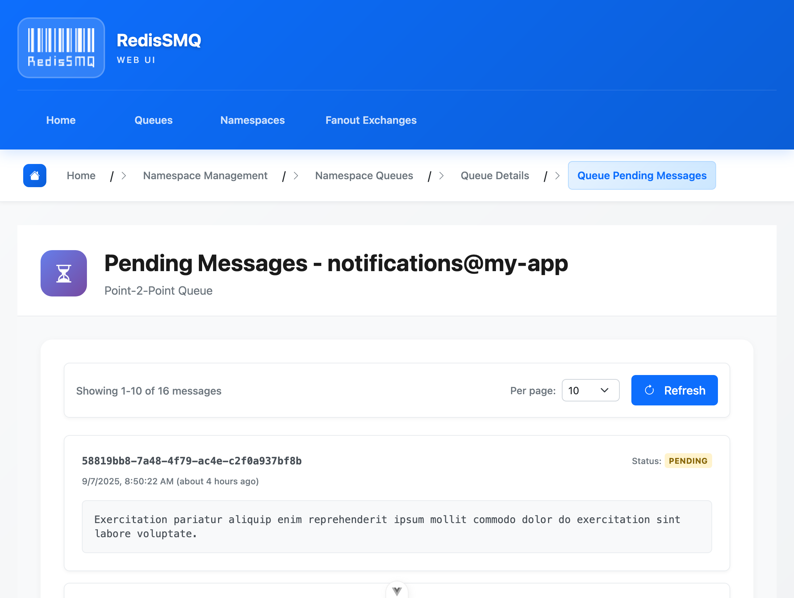

# RedisSMQ Web UI



A Single Page Application for monitoring and managing RedisSMQ: inspect queues, messages, consumers, and more — with an integrated OpenAPI client.

- Works seamlessly with the RedisSMQ REST API
- Best served via the RedisSMQ Web Server (serves static UI and hosts or proxies the API)
- Ships with developer-friendly tooling, types, and test setup

## Features

- Dashboard to overview queues, consumers, and message stats
- Queue/message browsers with filters and actions (ack, retry, delete, etc.)
- Support for FIFO/LIFO and multiple delivery models
- Integrated documentation via Swagger UI (when served with the REST API)
- Type-safe OpenAPI client (generated)

## Version compatibility

Always install matching versions of RedisSMQ packages. See the root docs for Version Compatibility. Use the same major/minor across:
- redis-smq
- redis-smq-common
- redis-smq-rest-api
- redis-smq-web-server
- redis-smq-web-ui

## Getting started

### Recommended: run via the Web Server

Use redis-smq-web-server to host the UI and API in one place, or proxy the API to an external service.

- In-process API:
    - UI at http://localhost:8080/
    - API at http://localhost:8080/api
- Proxy to an external REST API:
    - UI is still served locally
    - API/docs/assets are forwarded to the upstream API

See [RedisSMQ Web Server](../redis-smq-web-server/README.md) for CLI options such as:
- --port
- --base-path
- --api-proxy-target

### Development

Prerequisites:
- Node.js >= 20
- PNPM (recommended)

From the monorepo root:

```bash
pnpm install
pnpm -w -C packages/redis-smq-web-ui dev
```

#### OpenAPI client generation

The UI uses a generated OpenAPI client. To regenerate:

```shell
pnpm -w -C packages/redis-smq-web-ui generate-openapi-client
```

Make sure redis-smq-rest-api (with OpenAPI endpoint) is reachable as configured by the generation script.

#### Running the dev Server

```bash
pnpm -w -C packages/redis-smq-web-ui dev
```

The dev script typically runs:

- Vite dev server for the UI
- A local REST API dev server for convenience

- Open the printed local URL to access the UI during development.
  
#### Building
  
From the monorepo root:

```shell
pnpm -w -C packages/redis-smq-web-ui build
```

Artifacts are output to the package’s dist directory. 
Serve the built assets with [RedisSMQ Web Server](../redis-smq-web-server/README.md) for correct routing and API integration.

#### Configuration and routing

- Base path: When served by redis-smq-web-server, the basePath is handled by the server and the UI will work under either / or a sub-path (e.g., /redis-smq).
- API endpoint: When using redis-smq-web-server, the UI automatically talks to the in-process API or the configured proxy target.
- Swagger UI and static docs are available when the REST API is hosted or proxied alongside the UI.

For standalone/static hosting, ensure your server:

- Serves the built assets under the desired public base path
- Proxies API requests to the REST API under the same base path (e.g., /api)

## Related packages

- [redis-smq](../redis-smq/README.md): Core message queue
- [redis-smq-common](../redis-smq-common/README.md): Shared components/utilities
- [redis-smq-rest-api](../redis-smq-rest-api/README.md): REST API with OpenAPI 3 schema and Swagger UI
- [redis-smq-web-server](../redis-smq-web-server/README.md): Static hosting + in-process or proxied API

## Contributing

Contributions are welcome. Please see the repository’s CONTRIBUTING.md in the project root.

## License

RedisSMQ Web UI is licensed under is released under the [MIT License](https://github.com/weyoss/redis-smq/blob/master/LICENSE).
