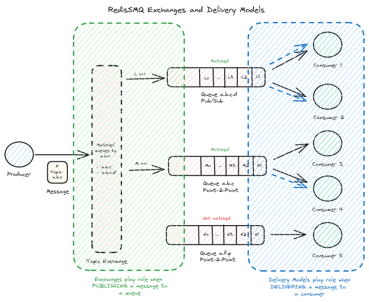

[RedisSMQ](../README.md) / [Docs](README.md) / Exchanges and Delivery Models

# Exchanges and Delivery Models



## Overview

Message exchanges and queue delivery models are distinct but complementary. Exchanges decide which queues receive a published message. Delivery models define how each queue delivers messages to its consumers. Together, they enable flexible fan-out, selective routing, and predictable consumer semantics.

- Exchanges route from producer to one or more queues.
- Delivery models determine how a given queue delivers messages to its consumers.

See also:
- Message Exchanges: [message-exchanges.md](message-exchanges.md)
- Queue Delivery Models: [queue-delivery-models.md](queue-delivery-models.md)

## Prerequisites

- Initialize RedisSMQ once per process:
  - `RedisSMQ.initialize(redisConfig, cb)`
  - or `RedisSMQ.initializeWithConfig(redisSMQConfig, cb)`
- Create components via RedisSMQ factory methods (recommended), for example:
  - `const queueManager = RedisSMQ.createQueueManager()`
  - `const producer = RedisSMQ.createProducer()`
  - `const consumer = RedisSMQ.createConsumer()`
- When components are created via RedisSMQ factory methods, you typically do not need to shut them down individually. 
Prefer a single `RedisSMQ.shutdown(cb)` at application exit to close shared infrastructure and tracked components.

## Message Exchanges (routing)

[Message Exchanges](message-exchanges.md) let producers publish to an exchange instead of a specific queue. The 
exchange then routes the message to zero, one, or multiple queues based on bindings and routing rules.

Common exchange types:
- Direct: exact routing key match
- Topic: wildcard pattern matching (AMQP-style)
- Fanout: broadcast to all bound queues

Key point: Exchanges only affect how messages are routed to queues. They do not change how queues deliver messages to consumers.

## Queue Delivery Models (consumption)

[Queue Delivery Models](queue-delivery-models.md) define how each queue delivers messages to its consumers:
- Point-to-Point: each message is delivered to a single consumer at a time
- Pub/Sub: messages are delivered to all consumer groups of the queue; within each group, only one consumer receives the message

Key point: The delivery model applies per queue, after messages arrive (either directly or via an exchange).

## How They Work Together

- A producer publishes to an exchange.
- The exchange routes the message to one or more queues based on bindings.
- Each target queue applies its delivery model to deliver the message to consumers of that queue.

This means a single published message can be routed to multiple queues, where each queue uses its own delivery model independently.

## Example: Direct exchange routing to different delivery models

The example below:
- Creates two queues:
  - `orders.worker` (Point-to-Point)
  - `orders.events` (Pub/Sub)
- Binds both queues to a direct exchange named `orders` with routing key `order.created`.
- Produces a message to the `orders` exchange
- Shows how consumption differs per queue

```javascript
'use strict';

const {
  RedisSMQ,
  EQueueType,
  EQueueDeliveryModel,
  ProducibleMessage,
} = require('redis-smq');
const { ERedisConfigClient } = require('redis-smq-common');

// 1) Initialize once per process
RedisSMQ.initialize(
  {
    client: ERedisConfigClient.IOREDIS,
    options: { host: '127.0.0.1', port: 6379, db: 0 },
  },
  (err) => {
    if (err) return console.error('Init failed:', err);

    // 2) Create queues with different delivery models
    const qm = RedisSMQ.createQueueManager();
    qm.save(
      'orders.worker',
      EQueueType.LIFO_QUEUE,
      EQueueDeliveryModel.POINT_TO_POINT,
      (e1) => {
        if (e1) return console.error('Create orders.worker failed:', e1);

        qm.save(
          'orders.events',
          EQueueType.LIFO_QUEUE,
          EQueueDeliveryModel.PUB_SUB,
          (e2) => {
            if (e2) return console.error('Create orders.events failed:', e2);

            // 3) Bind queues to a direct exchange
            const direct = RedisSMQ.createDirectExchange();
            direct.bindQueue('orders.worker', 'orders', 'order.created', (b1) => {
              if (b1) return console.error('Bind worker failed:', b1);

              direct.bindQueue(
                'orders.events',
                'orders',
                'order.created',
                (b2) => {
                  if (b2) return console.error('Bind events failed:', b2);

                  // 4) Produce a message to the exchange
                  const producer = RedisSMQ.createProducer();
                  producer.run((prErr) => {
                    if (prErr) return console.error('Producer start failed:', prErr);

                    const msg = new ProducibleMessage()
                      .setDirectExchange('orders')
                      .setExchangeRoutingKey('order.created')
                      .setBody({ orderId: 'O-1001' });

                    producer.produce(msg, (prodErr, messageIds) => {
                      if (prodErr) return console.error('Produce failed:', prodErr);
                      console.log(`Delivered to ${messageIds.length} queue(s):`, messageIds);

                      // Note: Prefer a single RedisSMQ.shutdown(cb) at application exit.
                    });
                  });
                },
              );
            });
          },
        );
      },
    );
  },
);
```

Consumption notes:
- `orders.worker` (Point-to-Point): each message is processed by exactly one consumer at a time. Consumers do not need a groupId.
- `orders.events` (Pub/Sub): the same message is delivered to all consumer groups of the queue; when consuming, you must provide a groupId.

Pub/Sub consume example:

```javascript
'use strict';

const { RedisSMQ } = require('redis-smq');
const { ERedisConfigClient } = require('redis-smq-common');

RedisSMQ.initialize(
  {
    client: ERedisConfigClient.IOREDIS,
    options: { host: '127.0.0.1', port: 6379 },
  },
  (err) => {
    if (err) return console.error('Init failed:', err);

    const consumer = RedisSMQ.createConsumer();

    consumer.consume(
      { queue: 'orders.events', groupId: 'email-service' },
      (msg, ack) => {
        // Process the event
        // ...
        ack();
      },
      (consumeErr) => {
        if (consumeErr) return console.error('Consume failed:', consumeErr);

        consumer.run((runErr) => {
          if (runErr) console.error('Consumer run error:', runErr);
          else console.log('orders.events consumer is running (email-service)');
        });
      },
    );
  },
);
```

## Best Practices

- Choose exchange type based on routing requirements:
    - Direct for exact matches, Topic for pattern-based routing, Fanout for broadcast.
- Model consumption per queue with the appropriate delivery model:
    - Point-to-Point for task queues and work distribution.
    - Pub/Sub for fan-out to multiple services (use consumer groups per service).
- Configure bindings during application startup. This avoids missing routes at runtime.
- Ensure at least one consumer group exists before producing to a Pub/Sub queue.
- Handle production errors:
    - If no queues match routing criteria (or no fanout bindings exist), expect a “No matching queues” error.
- When creating components via RedisSMQ factory methods, prefer a single RedisSMQ.shutdown(cb) at process exit rather than shutting down instances individually.

## Summary

- Exchanges decide which queues receive a message.
- Delivery models decide how each queue delivers messages to consumers.
- Combining both lets you route a single published message to multiple queues and deliver them according to each queue’s semantics.

For deeper dives, see:
- message-exchanges.md for exchange types and API
- queue-delivery-models.md for delivery semantics and consumer groups
