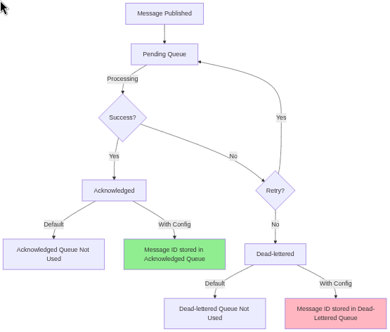

[RedisSMQ](../README.md) / [Documentation](README.md) / Message Audit

# Message Audit

Track processed messages for monitoring and debugging. By default, RedisSMQ doesn't store processing history — enable
audit to keep records.

## Overview



RedisSMQ provides three types of message audit:

1. **Acknowledged Messages** - Successfully processed messages
2. **Dead-Lettered Messages** - Messages that failed processing and exceeded retry limits
3. **Unacknowledgement History** - Complete failure timeline for each message

## Quick Start

Enable audit in your configuration:

```javascript
const config = {
  messageAudit: true, // Track all audit types
};

configManager.updateConfig(config, (err) => {
  // ...
});
```

Or track specific types:

```javascript
const config = {
  messageAudit: {
    acknowledgedMessages: true, // Track successful messages
    deadLetteredMessages: true, // Track failed messages
    unacknowledgementHistory: true, // Track failure timeline per message
  },
};
```

## Why Use Message Audit?

| Without Audit                       | With Audit                                     |
| ----------------------------------- | ---------------------------------------------- |
| Can't see processed message history | Can browse acknowledged/dead-lettered messages |
| Hard to debug failures              | Track which messages failed and why            |
| No processing metrics               | Monitor success/failure rates per queue        |
| Limited failure context             | Complete timeline of each failure event        |

## Configuration Options

### Basic Tracking

```javascript
const config = {
  messageAudit: true, // Track everything (acknowledged, dead-lettered, history)
};
```

### Selective Tracking

```javascript
const config = {
  messageAudit: {
    acknowledgedMessages: true, // Track successes only
    deadLetteredMessages: true, // Track failures only
    unacknowledgementHistory: true, // Track failure timeline
  },
};
```

### With Limits

```javascript
const config = {
  messageAudit: {
    acknowledgedMessages: {
      queueSize: 5000, // Keep last 5,000 successful messages
      expire: 43200, // Delete after 12 hours (seconds)
    },
    deadLetteredMessages: {
      queueSize: 10000, // Keep last 10,000 failed messages
      expire: 604800, // Delete after 7 days
    },
    unacknowledgementHistory: {
      enabled: true,
      maxSize: 100, // Keep last 100 failure events per message
    },
  },
};
```

## Using Message Audit

### Browse Tracked Messages

```javascript
const { RedisSMQ } = require('redis-smq');

// These work with or without audit
const publishedMessages = RedisSMQ.createQueuePublishedMessages();
const pendingMessages = RedisSMQ.createQueuePendingMessages();

// These REQUIRE audit enabled
const acknowledged = RedisSMQ.createQueueAcknowledgedMessages();
const deadLettered = RedisSMQ.createQueueDeadLetteredMessages();

// Count tracked messages
acknowledged.countMessages('my-queue', (err, count) => {
  console.log(`Successfully processed: ${count}`);
});

// Browse recent failures
deadLettered.getMessages('my-queue', 1, 50, (err, page) => {
  console.log('Recent failures:', page.items);
});
```

### View Unacknowledgement History

```javascript
const messageManager = RedisSMQ.getMessageManager();
const history =
  await messageManager.getMessageUnacknowledgementHistory(messageId);

// Example output
[
  {
    messageId: '188143f1-accb-4587-87cb-90cbae280762',
    cause: 2, // EMessageUnacknowledgementCause
    action: 0, // EMessageUnacknowledgementAction
    timestamp: 1774633655377,
    retryCount: 3,
    queue: { queueParams: [Object], groupId: null },
    consumerId: 'd928b4cc-6165-4857-9322-f92108771a1c',
    deadLetterCause: 1, // EMessageDeadLetterCause
  },
  {
    messageId: '188143f1-accb-4587-87cb-90cbae280762',
    cause: 2,
    action: 2,
    timestamp: 1774633646355,
    retryCount: 2,
    queue: { queueParams: [Object], groupId: null },
    consumerId: 'd928b4cc-6165-4857-9322-f92108771a1c',
  },
  {
    messageId: '188143f1-accb-4587-87cb-90cbae280762',
    cause: 2,
    action: 2,
    timestamp: 1774633643065,
    retryCount: 1,
    queue: { queueParams: [Object], groupId: null },
    consumerId: 'd928b4cc-6165-4857-9322-f92108771a1c',
  },
];
```

### Always Available (No Audit Needed)

```javascript
// All messages in queue (including pending, scheduled)
const all = RedisSMQ.createQueuePublishedMessages();
all.getMessages('my-queue', 1, 100, (err, page) => {
  console.log('All messages:', page.items);
});

// Pending messages (waiting to be processed)
const pending = RedisSMQ.createQueuePendingMessages();

// Scheduled messages (future delivery)
const scheduled = RedisSMQ.createQueueScheduledMessages();
```

## Understanding Unacknowledgement History

Each time a message fails to be acknowledged, RedisSMQ records:

- **Cause**: Why it failed (timeout, consume error, TTL expired, etc.)
- **Action**: What happened next (requeue, delay, dead-letter)
- **Timestamp**: When the failure occurred
- **Consumer**: Which consumer attempted processing
- **Dead Letter Cause**: If moved to DLQ, why (retry threshold, TTL expired, periodic message)

This timeline helps you:

- Debug why messages fail repeatedly
- Identify patterns in failures
- Understand exactly when messages entered dead-letter
- Audit consumer behavior

## Troubleshooting

### "Cannot access acknowledged/dead-lettered messages"

**Solution**: Enable `messageAudit` in your configuration.

### High Redis memory usage

**Solution**:

- Reduce `queueSize` for acknowledged/dead-lettered messages
- Lower `maxSize` for unacknowledgement history
- Disable audit for high-volume queues
- Consider shorter `expire` times

### Unacknowledgement history not showing

**Solution**:

- Enable `messageAudit.unacknowledgementHistory = true` in config
- Verify messages are actually failing (check logs)

### Need to retain history longer

**Solution**:

- For acknowledged/dead-lettered: Increase `expire` value
- For unacknowledgement history: Increase `maxSize` value

## API Reference

- See [IMessageAuditConfig](api/interfaces/IMessageAuditConfig.md)
- See [MessageManager](api/classes/MessageManager.md)

---

**Related**:

- [Configuration Guide](configuration.md) - Complete setup options
- [QueuePublishedMessages API](api/classes/QueuePublishedMessages.md) - All message management
