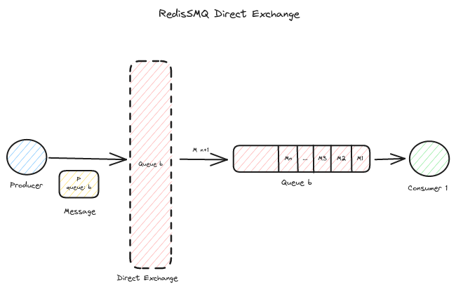
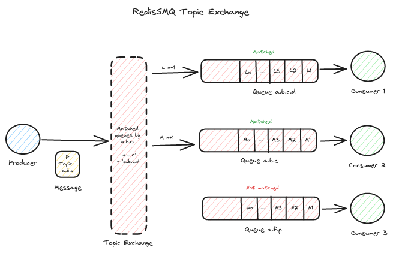
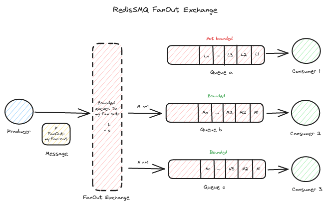

[RedisSMQ](../README.md) / [Docs](README.md) / Message Exchanges

# Message Exchanges

Starting with version 7.1.0, RedisSMQ introduces message exchanges, which provide flexible routing methods for
directing messages to one or more queues.

A message exchange functions as an address or routing algorithm that determines the destinations for a message.

Each message must be associated with a message exchange, which enables the producer to identify the list of queues that
correspond to the exchange parameters.

Subsequently, the producer directly publishes the message to the matched queues.

When a message is sent to multiple queues, a unique message is created for each queue with the same properties as the
original message, but each will have a different ID. All messages that are created and published to multiple queues
through a specific message exchange share a common Exchange Tag.

The Exchange Tag serves as a unique identifier to track all messages published to the identified queues at the moment
of publication.

RedisSMQ supports three exchange types out of the box:

## 1. Direct Exchange



A direct exchange allows producers to send a message to a specific queue that exactly matches the designated exchange
queue.

The queue can be specified as a string (e.g., `a.b.c.d`) or as an object that describes the queue's namespace
`{ ns: 'my-app', name: 'a.b.c.d'}`. If a string is provided, RedisSMQ will utilize the default namespace.

For example, a direct exchange targeting the queue `a.b.c.d` will only match the queue named exactly as `a.b.c.d`.

### Usage

To configure a direct exchange for a message, use the [ProducibleMessage Class](api/classes/ProducibleMessage.md) and the method [ProducibleMessage.setQueue()](api/classes/ProducibleMessage.md#setqueue):

```typescript
const { ProducibleMessage } = require('redis-smq');

const msg = new ProducibleMessage();
msg.setQueue('a.b.c.d').setBody('123456789');
```

When publishing a message with a direct exchange, if the target queue does not exist, the message will not be sent, and an error will be returned.

To retrieve the list of queues associated with a direct exchange, utilize [ExchangeDirect.getQueues()](api/classes/ExchangeDirect.md#getqueues).

For further details, visit:

- [ExchangeDirect Class](api/classes/ExchangeDirect.md)

## 2. Topic Exchange



A topic exchange allows messages to be published to one or multiple queues that match a specified topic pattern using regular expressions.

The topic pattern can be any valid regular expression, providing powerful and flexible queue matching capabilities.

### Pattern Examples

**Simple prefix matching:**
```javascript
// Pattern: "user"
// Matches: "user", "user.created", "user.updated", "user.deleted"
```

**Exact matching:**
```javascript
// Pattern: "^order\.created$"
// Matches: "order.created" (exact match only)
```

**Wildcard patterns:**
```javascript
// Pattern: "user\.(created|updated|deleted)"
// Matches: "user.created", "user.updated", "user.deleted"
```

**Complex patterns:**
```javascript
// Pattern: "^(user|admin)\..*\.priority\.(high|critical)$"
// Matches: "user.account.priority.high", "admin.system.priority.critical"
```

**Namespace-aware patterns:**
```javascript
// Pattern with namespace object
{ ns: 'my-app', topic: '^notification\.(email|sms)$' }
// Matches queues in 'my-app' namespace: "notification.email", "notification.sms"
```

### Usage

To set up a topic exchange for a message, use the [ProducibleMessage Class](api/classes/ProducibleMessage.md) and the method [ProducibleMessage.setTopic()](api/classes/ProducibleMessage.md#settopic):

```javascript
const { ProducibleMessage } = require('redis-smq');

const msg = new ProducibleMessage();

// Simple pattern matching
msg.setTopic('user').setBody('123456789');

// Regex pattern for specific events
msg.setTopic('order\\.(created|updated)').setBody('order data');

// Namespace-specific pattern
msg.setTopic({ ns: 'my-app', topic: '^notification\\.' }).setBody('notification');
```

**Important Notes:**
- Topic patterns are treated as regular expressions, so special regex characters need to be escaped
- Use double backslashes (`\\`) in JavaScript strings to escape regex special characters
- If no namespace is specified, the default namespace will be applied
- The pattern is matched against the full queue name

If the topic pattern does not correspond to any queues, the message will be deleted and an error will be generated.

To fetch the list of queues associated with a topic exchange, employ [ExchangeTopic.getQueues()](api/classes/ExchangeTopic.md#getqueues).

For more information, refer to:

- [ExchangeTopic Class](api/classes/ExchangeTopic.md)

## 3. FanOut Exchange



A FanOut exchange enables producers to publish a message to all queues that are bound to the exchange via a binding key.

### Usage

To use a FanOut exchange, you must first create it via [ExchangeFanOut.saveExchange()](api/classes/ExchangeFanOut.md#saveexchange) and then bind one or more queues to the exchange through ExchangeFanOut.bindQueue().

To set up a FanOut exchange for a message, the [ProducibleMessage API](api/classes/ProducibleMessage.md) utilizes [ProducibleMessage.setFanOut()](api/classes/ProducibleMessage.md#setfanout):

  ```javascript
const { ProducibleMessage } = require('redis-smq');

const msg = new ProducibleMessage();

// Assuming that my-FanOut-exchange already exists
msg.setFanOut('my-FanOut-exchange').setBody('123456789');
```

When publishing with a FanOut exchange, if the exchange does not exist or no queues are associated, the message will be discarded and an error returned.

To find out which queues are associated with a FanOut exchange, use [ExchangeFanOut.getQueues()](api/classes/ExchangeFanOut.md#getqueues).

For further details, consult:

- [ExchangeFanOut Class](api/classes/ExchangeFanOut.md)
