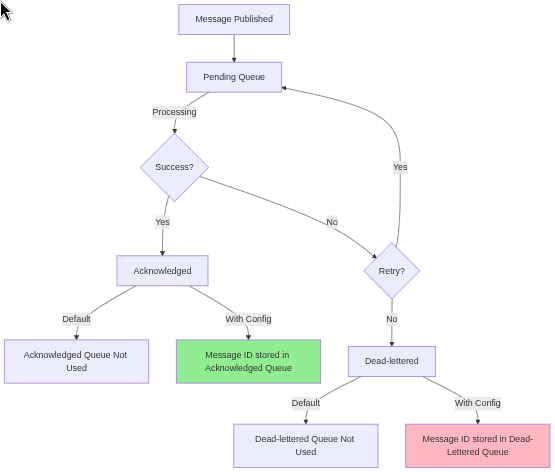

[RedisSMQ](../README.md) / [Docs](README.md) / Message Storage

# Message Storage

## Overview

RedisSMQ stores all messages in Redis data structures, with different storage mechanisms depending on message status 
and configuration. Understanding these storage patterns is essential for efficient queue management and troubleshooting.

## Prerequisites

- Initialize RedisSMQ once per process before creating components:
  - `RedisSMQ.initialize(redisConfig, cb)`, or
  - `RedisSMQ.initializeWithConfig(redisSMQConfig, cb)`
- Prefer creating components via RedisSMQ factory methods (e.g., `RedisSMQ.createQueueMessages()`, `RedisSMQ.createMessageManager()`).
- When components are created via RedisSMQ factory methods, you typically do not need to shut them down individually. 
Prefer a single `RedisSMQ.shutdown(cb)` at application exit to close shared infrastructure and tracked components.

## Default Storage Behavior

By default:
- All published messages are stored in their respective queues until acknowledged, expired, or explicitly deleted.
- Acknowledged messages are not retained in separate storage after processing.
- Dead-lettered messages are not retained in separate storage after failing.

This default configuration optimizes Redis memory usage while maintaining core functionality.

## Message Types and Storage Requirements

RedisSMQ provides specialized classes for managing different types of messages:

| Message Type  | Management Class                                                      | Default Storage | Additional Storage Required? |
|---------------|-----------------------------------------------------------------------|-----------------|------------------------------|
| All Messages  | [QueueMessages](api/classes/QueueMessages.md)                         | Main queue      | No                           |
| Scheduled     | [QueueScheduledMessages](api/classes/QueueScheduledMessages.md)       | Scheduled queue | No                           |
| Pending       | [QueuePendingMessages](api/classes/QueuePendingMessages.md)           | Pending queue   | No                           |
| Acknowledged  | [QueueAcknowledgedMessages](api/classes/QueueAcknowledgedMessages.md) | None            | Yes                          |
| Dead-lettered | [QueueDeadLetteredMessages](api/classes/QueueDeadLetteredMessages.md) | None            | Yes                          |

Important
- To use `QueueAcknowledgedMessages` or `QueueDeadLetteredMessages`, you must explicitly enable additional storage for 
these message types in your configuration (see `messages.store` below).

## Message Lifecycle and Storage



## Configuration Options

The `messages.store` configuration allows you to:
1. Enable dedicated storage for acknowledged messages
2. Enable dedicated storage for dead-lettered messages
3. Set retention limits (by count and/or time) for each storage type

### Basic Configuration Structure

_Units_
- queueSize: count of stored messages per queue
- expire: time to retain messages, in seconds

```typescript
interface IMessageStoreConfig {
  acknowledged?: boolean | {
    queueSize?: number; // max messages per queue
    expire?: number;    // retention time in seconds
  };
  deadLettered?: boolean | {
    queueSize?: number; // max messages per queue
    expire?: number;    // retention time in seconds
  };
}
```

## Configuration Examples

### Example 1: Enable Dead-Lettered Message Storage

```typescript
import { IRedisSMQConfig } from 'redis-smq';

const config: IRedisSMQConfig = {
  messages: {
    store: {
      deadLettered: true, // Store all dead-lettered messages indefinitely
    },
  },
};
```

### Example 2: Store All Acknowledged Messages, Limit Dead-Lettered Messages

```typescript
import { IRedisSMQConfig } from 'redis-smq';

const config: IRedisSMQConfig = {
  messages: {
    store: {
      acknowledged: true, // Store all acknowledged messages indefinitely
      deadLettered: {
        queueSize: 100000, // Store up to 100,000 dead-lettered messages per queue
        expire: 24 * 60 * 60, // Retain for 1 day (in seconds)
      },
    },
  },
};
```

### Example 3: Limit Both Message Types with Different Retention Policies

```typescript
import { IRedisSMQConfig } from 'redis-smq';

const config: IRedisSMQConfig = {
  messages: {
    store: {
      acknowledged: {
        queueSize: 5000,       // Store up to 5,000 acknowledged messages per queue
        expire: 12 * 60 * 60,  // Retain for 12 hours (in seconds)
      },
      deadLettered: {
        queueSize: 10000,      // Store up to 10,000 dead-lettered messages per queue
        expire: 7 * 24 * 60 * 60, // Retain for 7 days (in seconds)
      },
    },
  },
};
```

## Accessing Messages Without Additional Storage

Even without enabling additional storage, you can still access messages by ID and browse queue contents.

```javascript
'use strict';

const { RedisSMQ } = require('redis-smq');
const { ERedisConfigClient } = require('redis-smq-common');

// Initialize once per process (if not already initialized)
RedisSMQ.initialize(
  {
    client: ERedisConfigClient.IOREDIS,
    options: { host: '127.0.0.1', port: 6379, db: 0 },
  },
  (err) => {
    if (err) return console.error('Init failed:', err);

    // Create managers via RedisSMQ (recommended)
    const messageManager = RedisSMQ.createMessageManager();
    const queueMessages = RedisSMQ.createQueueMessages();

    // Get a specific message by ID
    messageManager.getMessageById('id1', (e, msg) => {
      if (e) console.error('getMessageById error:', e);
      else console.log('Message:', msg);
    });

    // Get multiple messages by IDs
    messageManager.getMessagesByIds(['id1', 'id2'], (e, messages) => {
      if (e) console.error('getMessagesByIds error:', e);
      else console.log('Messages:', messages);
    });

    // Get message state/status
    messageManager.getMessageState('id1', (e, state) => {
      if (e) console.error('getMessageState error:', e);
      else console.log('State:', state);
    });
    messageManager.getMessageStatus('id1', (e, status) => {
      if (e) console.error('getMessageStatus error:', e);
      else console.log('Status:', status);
    });

    // Browse all messages (pending/ack/dead-lettered/scheduled as available)
    queueMessages.getMessages('my-queue', 1, 100, (e, page) => {
      if (e) console.error('getMessages error:', e);
      else console.log('Page:', page);
    });

    // Preferred at application exit:
    // RedisSMQ.shutdown((e) => e && console.error('Shutdown error:', e));
  },
);
```

_Note_
- Without dedicated storage, acknowledged and dead-lettered messages are not retained beyond their normal lifecycle. 
You can still retrieve specific messages by ID while they remain accessible in system data structures.

## Storage Considerations

- Memory usage: Storing all acknowledged messages may significantly increase Redis memory consumption.
- Performance: Large retention windows increase Redis operations and memory; prioritize only what you need for 
observability.
- Monitoring needs: Balance retention requirements (auditing/troubleshooting) against system resources.

## Best Practices

- Enable acknowledged message storage only when message history tracking is required.
- Enable dead-lettered message storage in production for troubleshooting failed messages.
- Set reasonable size limits based on your queue throughput and available memory.
- Configure time-based expiration (expire in seconds) for compliance with data retention policies.
- Monitor Redis memory usage and command latency when using extensive message storage.
- For the fastest routing path, prefer direct queue publishing (`setQueue`) over exchanges when applicable 
(see [performance.md](performance.md)).

## Summary

- By default, only the main queue is persisted; acknowledged and dead-lettered messages are not retained unless configured.
- To manage acknowledged or dead-lettered messages via their dedicated classes, configure `messages.store` with 
per-type limits and expiration.
- Use [MessageManager](api/classes/MessageManager.md) and [QueueMessages](api/classes/QueueManager.md) to inspect 
messages even without dedicated storage.
- Balance storage needs against system resources and performance requirements, using size/time limits to prevent 
unbounded growth.
