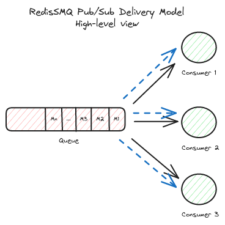

[RedisSMQ](../README.md) / [Docs](README.md) / Queue Delivery Models

# Queue Delivery Models

RedisSMQ offers two reliable message delivery models: Point-to-Point and Pub/Sub. This guide explains each model with
updated examples using the RedisSMQ class, along with best practices.

---

## Point-to-Point Delivery Model


In the Point-to-Point model, a message is produced to a queue and delivered to a single consumer at a time. Each message is processed once by one consumer.

### Creating a Point-to-Point Queue

```javascript
'use strict';

const { RedisSMQ, EQueueDeliveryModel, EQueueType } = require('redis-smq');
const { ERedisConfigClient } = require('redis-smq-common');

// Initialize once per process
RedisSMQ.initialize(
  {
    client: ERedisConfigClient.IOREDIS,
    options: { host: '127.0.0.1', port: 6379, db: 0 },
  },
  (err) => {
    if (err) return console.error('Init failed:', err);

    const queueManager = RedisSMQ.createQueueManager();
    queueManager.save(
      'my-queue',
      EQueueType.LIFO_QUEUE,
      EQueueDeliveryModel.POINT_TO_POINT,
      (saveErr, reply) => {
        if (saveErr) console.error('Error creating queue:', saveErr);
        else console.log('Successfully created queue:', reply);
      },
    );
  },
);
```

Refer to [`QueueManager.save()`](api/classes/QueueManager.md#save) for additional details.

### Publishing a Message to a Point-to-Point Queue

```javascript
'use strict';

const { RedisSMQ, ProducibleMessage } = require('redis-smq');
const { ERedisConfigClient } = require('redis-smq-common');

RedisSMQ.initialize(
  {
    client: ERedisConfigClient.IOREDIS,
    options: { host: '127.0.0.1', port: 6379 },
  },
  (err) => {
    if (err) return console.error('Init failed:', err);

    const producer = RedisSMQ.createProducer();
    producer.run((runErr) => {
      if (runErr) return console.error('Error running producer:', runErr);

      const message = new ProducibleMessage()
        .setBody('hello world')
        .setQueue('my-queue');

      producer.produce(message, (produceErr, ids) => {
        if (produceErr) console.error('Error producing message:', produceErr);
        else console.log('Successfully produced message IDs:', ids);
      });
    });
  },
);
```

Refer to [`Producer.produce()`](api/classes/Producer.md#produce) for more details.

### Consuming a Message from a Point-to-Point Queue

```javascript
'use strict';

const { RedisSMQ } = require('redis-smq');
const { ERedisConfigClient } = require('redis-smq-common');

RedisSMQ.initialize(
  {
    client: ERedisConfigClient.IOREDIS,
    options: { host: '127.0.0.1', port: 6379 },
  },
  (err) => {
    if (err) return console.error('Init failed:', err);

    const consumer = RedisSMQ.createConsumer();

    const messageHandler = (msg, cb) => {
      // Your processing logic here...
      cb(); // acknowledge
    };

    consumer.consume('my-queue', messageHandler, (consumeErr) => {
      if (consumeErr)
        console.error('Error adding message handler:', consumeErr);
      else console.log('Message handler added successfully');
    });

    consumer.run((runErr) => {
      if (runErr) console.error('Error running consumer:', runErr);
      else console.log('Consumer is running');
    });
  },
);
```

---

## Pub/Sub Delivery Model

### Overview



In the Pub/Sub model, messages are delivered to all consumer groups of a queue. Within each consumer group, only one
consumer receives the message. Every group gets a copy, enabling fan-out while keeping per-group ordering and retry
semantics.

### Consumer Groups


- A consumer group is required to consume from a Pub/Sub queue.
- When publishing a message to a Pub/Sub queue, it is sent to all consumer groups associated with that queue.
- Within each consumer group, only one consumer will receive the message.
- If a message remains unacknowledged for a given time, it will be retried similarly to Point-to-Point queues.
- If the retry threshold is exceeded, failed messages can be stored (if configured) in the dead-letter queue.

You can manage consumer groups programmatically:

```javascript
'use strict';

const { RedisSMQ } = require('redis-smq');
const { ERedisConfigClient } = require('redis-smq-common');

RedisSMQ.initialize(
  {
    client: ERedisConfigClient.IOREDIS,
    options: { host: '127.0.0.1', port: 6379 },
  },
  (err) => {
    if (err) return console.error('Init failed:', err);

    const groups = RedisSMQ.createConsumerGroups();
    groups.saveConsumerGroup('my-pubsub-queue', 'my-app-group-1', (e, code) => {
      if (e) console.error('Failed to save consumer group:', e);
      else console.log('Consumer group saved:', code);
    });
  },
);
```

Refer to the [ConsumerGroups class](api/classes/ConsumerGroups.md) for managing consumer groups. In many cases, a group
can also be created implicitly the first time you start consuming with a given groupId.

### Creating a Pub/Sub Queue

```javascript
'use strict';

const { RedisSMQ, EQueueDeliveryModel, EQueueType } = require('redis-smq');
const { ERedisConfigClient } = require('redis-smq-common');

RedisSMQ.initialize(
  {
    client: ERedisConfigClient.IOREDIS,
    options: { host: '127.0.0.1', port: 6379, db: 0 },
  },
  (err) => {
    if (err) return console.error('Init failed:', err);

    const queueManager = RedisSMQ.createQueueManager();
    queueManager.save(
      'my-pubsub-queue',
      EQueueType.LIFO_QUEUE,
      EQueueDeliveryModel.PUB_SUB,
      (saveErr, reply) => {
        if (saveErr) console.error('Error creating Pub/Sub queue:', saveErr);
        else console.log('Successfully created Pub/Sub queue:', reply);
      },
    );
  },
);
```

Refer to [`QueueManager.save()`](api/classes/QueueManager.md#save) for additional details.

### Publishing a Message to a Pub/Sub Queue

Note: When producing a message to a Pub/Sub queue, at least one consumer group must exist. If no groups exist, an error
will be returned.

```javascript
'use strict';

const { RedisSMQ, ProducibleMessage } = require('redis-smq');
const { ERedisConfigClient } = require('redis-smq-common');

RedisSMQ.initialize(
  {
    client: ERedisConfigClient.IOREDIS,
    options: { host: '127.0.0.1', port: 6379 },
  },
  (err) => {
    if (err) return console.error('Init failed:', err);

    const producer = RedisSMQ.createProducer();
    producer.run((runErr) => {
      if (runErr) return console.error('Error running producer:', runErr);

      const message = new ProducibleMessage()
        .setBody('hello world')
        .setQueue('my-pubsub-queue');

      producer.produce(message, (produceErr, ids) => {
        if (produceErr) console.error('Error producing message:', produceErr);
        else
          console.log('Successfully produced to group(s), message IDs:', ids);
      });
    });
  },
);
```

Refer to [`Producer.produce()`](api/classes/Producer.md#produce) for more details.

### Consuming a Message from a Pub/Sub Queue

Provide the consumer group ID when consuming from a Pub/Sub queue:

```javascript
'use strict';

const { RedisSMQ } = require('redis-smq');
const { ERedisConfigClient } = require('redis-smq-common');

RedisSMQ.initialize(
  {
    client: ERedisConfigClient.IOREDIS,
    options: { host: '127.0.0.1', port: 6379 },
  },
  (err) => {
    if (err) return console.error('Init failed:', err);

    const consumer = RedisSMQ.createConsumer();

    const messageHandler = (msg, cb) => {
      // process message...
      cb(); // acknowledge
    };

    consumer.consume(
      { queue: 'my-pubsub-queue', groupId: 'my-app-group-1' },
      messageHandler,
      (consumeErr) => {
        if (consumeErr)
          console.error('Error adding message handler:', consumeErr);
        else console.log('Message handler added');
      },
    );

    consumer.run((runErr) => {
      if (runErr) console.error('Error running consumer:', runErr);
      else console.log('Consumer is running');
    });
  },
);
```

_Note:_

If you do not provide a consumer group ID when consuming messages from a Pub/Sub queue, the consumer will create an ephemeral consumer group for the session. Provide a consumer group ID to join a persistent, named group.
