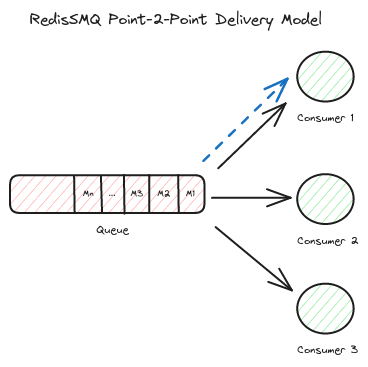
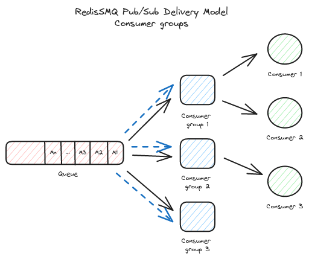

[RedisSMQ](../README.md) / [Docs](README.md) / Queue Delivery Models

# Queue Delivery Models

RedisSMQ supports two ways to deliver messages: **Point-to-Point** (one consumer) and **Pub/Sub** (broadcast to groups).

## Point-to-Point (One Consumer)



Messages are delivered to exactly one consumer. Each message is processed once.

### Create a Point-to-Point Queue

```javascript
const { RedisSMQ, EQueueDeliveryModel, EQueueType } = require('redis-smq');

const queueManager = RedisSMQ.createQueueManager();
queueManager.save(
  'orders',
  EQueueType.LIFO_QUEUE,
  EQueueDeliveryModel.POINT_TO_POINT,
  (err) => {
    if (err) console.error('Failed:', err);
    else console.log('Queue created');
  },
);
```

### Send a Message

```javascript
const msg = new ProducibleMessage()
  .setQueue('orders') // Send directly to queue
  .setBody({ orderId: 123 });

producer.produce(msg, (err, messageIds) => {
  if (err) console.error('Failed:', err);
  else console.log('Message sent');
});
```

### Consume Messages

```javascript
consumer.consume(
  'orders',
  (msg, done) => {
    console.log('Processing:', msg.body);
    done(); // Acknowledge
  },
  callback,
);
```

**Best for**: Task queues, job processing, ordered workflows.

## Pub/Sub (Broadcast to Groups)



Messages are delivered to **all consumer groups**. Within each group, only one consumer receives the message.

### Create a Pub/Sub Queue

```javascript
queueManager.save(
  'notifications',
  EQueueType.LIFO_QUEUE,
  EQueueDeliveryModel.PUB_SUB,
  (err) => {
    if (err) console.error('Failed:', err);
    else console.log('Pub/Sub queue created');
  },
);
```

### Create Consumer Groups

```javascript
const groups = RedisSMQ.createConsumerGroups();
groups.saveConsumerGroup('notifications', 'email-service', (err) => {
  if (err) console.error('Failed:', err);
  else console.log('Group created');
});

// Groups are created automatically when you first consume with a groupId
```

### Send a Message (Same as Point-to-Point)

```javascript
const msg = new ProducibleMessage()
  .setQueue('notifications')
  .setBody({ alert: 'New message' });

producer.produce(msg, (err, messageIds) => {
  // Message goes to ALL consumer groups
  console.log(`Sent to ${messageIds.length} group(s)`);
});
```

### Consume with a Group

```javascript
consumer.consume(
  { queue: 'notifications', groupId: 'email-service' }, // Specify group
  (msg, done) => {
    console.log('Email service processing:', msg.body);
    done();
  },
  callback,
);

// Another service can use same queue, different group
consumer.consume(
  { queue: 'notifications', groupId: 'sms-service' },
  (msg, done) => {
    console.log('SMS service processing:', msg.body);
    done();
  },
  callback,
);
```

## Key Differences

| Feature      | Point-to-Point    | Pub/Sub                     |
| ------------ | ----------------- | --------------------------- |
| **Delivery** | One consumer      | All groups                  |
| **Groups**   | Not used          | Required                    |
| **Use Case** | Job processing    | Multi-service notifications |
| **Setup**    | Just create queue | Create queue + groups       |

## Example Workflows

### Order Processing (Point-to-Point)

```
Order → [orders queue] → Payment Service (only one processes each order)
```

### Notification System (Pub/Sub)

```
Alert → [notifications queue]
        ├─→ Email Service (group 1)
        ├─→ SMS Service (group 2)
        └─→ Push Service (group 3)
```

## Best Practices

1. **Use Point-to-Point for**:
   - Job queues
   - Ordered processing
   - Single-consumer tasks

2. **Use Pub/Sub for**:
   - Event broadcasting
   - Multi-service notifications
   - Fan-out patterns

3. **Group Management**:
   - Create groups before sending messages
   - Use meaningful group names (service-name, function)
   - Monitor group consumption rates

4. **Error Handling**:
   - Both models support retries and dead-letter queues
   - Each group in Pub/Sub has its own retry tracking

---

**Related Documentation**:

- [Queues](queues.md) - Queue management and types
- [Consuming Messages](consuming-messages.md) - How to receive messages
- [ConsumerGroups API](api/classes/ConsumerGroups.md) - Group management
