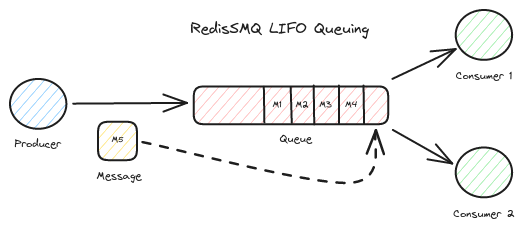
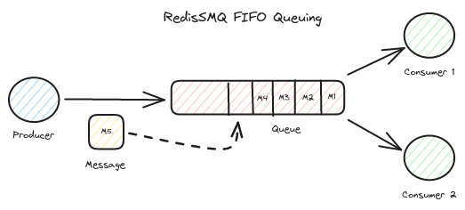
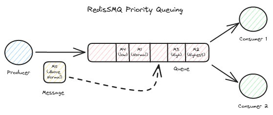

[RedisSMQ](../README.md) / [Docs](README.md) / Queues

# Queues

In RedisSMQ, a queue plays a crucial role in managing messages produced by producers and consumed by consumers.
The system supports three distinct types of queues: LIFO (Last In, First Out), FIFO (First In, First Out), and
Priority queues.

## Prerequisites

- Initialize RedisSMQ once per process using `RedisSMQ.initialize(...)` or `RedisSMQ.initializeWithConfig(...)`.
- Create queue-related managers via RedisSMQ factory methods, for example: `const queueManager = RedisSMQ.createQueueManager()`.
- When components are created via RedisSMQ factory methods, you typically do not need to shut them down individually. 
Prefer calling `RedisSMQ.shutdown(cb)` at application exit to close shared infrastructure and tracked components.

## Reliability

All RedisSMQ queue types are designed to be reliable. Reliability ensures that messages are not lost, even in the
event of failures, such as a consumer crash. The system can recover from failure scenarios, maintaining message
integrity throughout the process.

## Queue Mechanics

In a typical LIFO or FIFO queue setup, RedisSMQ uses the `brpoplpush` command to
block the connection to the Redis server until a message is available. Conversely, priority queues employ pooling and
Lua scripting, which may introduce additional overhead and result in slightly reduced performance compared to LIFO and
FIFO queues.

For simplicity in the upcoming examples, we will utilize the `EQueueDeliveryModel.POINT_TO_POINT` delivery model across
all queue types. However, you can customize your application by choosing any combination of `EQueueType` and
`EQueueDeliveryModel` that suits your needs.

## LIFO (Last In, First Out) Queues



In a LIFO queue, the most recently published messages are delivered first, while the oldest messages are delivered last.

```javascript
'use strict';

const { RedisSMQ, EQueueType, EQueueDeliveryModel } = require('redis-smq');
const { ERedisConfigClient } = require('redis-smq-common');

// Initialize once per process
RedisSMQ.initialize(
  {
    client: ERedisConfigClient.IOREDIS,
    options: { host: '127.0.0.1', port: 6379, db: 0 },
  },
  (err) => {
    if (err) return console.error('Init failed:', err);

    const queueManager = RedisSMQ.createQueueManager();
    queueManager.save(
      'my_queue',
      EQueueType.LIFO_QUEUE,
      EQueueDeliveryModel.POINT_TO_POINT,
      (saveErr) => {
        if (saveErr) return console.error('Queue creation failed:', saveErr);
        console.log('LIFO queue created');
        // No need to shutdown queueManager individually if created via RedisSMQ
        // Prefer a single RedisSMQ.shutdown(cb) at application exit
      },
    );
  },
);
```

For additional details, please refer to the [`QueueManager.save()`](api/classes/QueueManager.md#save) documentation.

## FIFO (First In, First Out) Queues



In a FIFO queue, messages are processed in the order they are received: the first published messages are delivered
first, followed by later entries.

```javascript
// Assuming RedisSMQ is already initialized and you have:
const queueManager = RedisSMQ.createQueueManager();

queueManager.save(
  'my_queue',
  EQueueType.FIFO_QUEUE,
  EQueueDeliveryModel.POINT_TO_POINT,
  (err) => {
    if (err) console.error(err);
    else console.log('FIFO queue created');
  },
);
```

Refer to [`QueueManager.save()`](api/classes/QueueManager.md#save) for more information.

## Priority Queues



Priority queues deliver messages based on their assigned priority, ensuring that those with higher priority are
processed before lower-priority messages.

```javascript
// Assuming RedisSMQ is already initialized and you have:
const queueManager = RedisSMQ.createQueueManager();

queueManager.save(
  'my_queue',
  EQueueType.PRIORITY_QUEUE,
  EQueueDeliveryModel.POINT_TO_POINT,
  (err) => {
    if (err) console.error(err);
    else console.log('Priority queue created');
  },
);
```

For further details, consult [QueueManager.save()](api/classes/QueueManager.md#save).

### Setting Up Message Priorities

To configure message priorities within your application, the [ProducibleMessage Class](api/classes/ProducibleMessage.md)
offers the following methods:

- [ProducibleMessage.setPriority()](api/classes/ProducibleMessage.md#setpriority)
- [ProducibleMessage.getPriority()](api/classes/ProducibleMessage.md#getpriority)

Valid priority values include:

- EMessagePriority.LOWEST
- EMessagePriority.VERY_LOW
- EMessagePriority.LOW
- EMessagePriority.NORMAL
- EMessagePriority.ABOVE_NORMAL
- EMessagePriority.HIGH
- EMessagePriority.VERY_HIGH
- EMessagePriority.HIGHEST

Please refer to the [EMessagePriority](api/enumerations/EMessagePriority.md) documentation for more information.

## Queue Namespacing

RedisSMQ uses namespacing to manage queues effectively. Each namespace acts as a scope, ensuring unique queue names and
preventing name collisions across multiple queues that may share the same name.

A queue can be identified by its name (e.g., `orders`) or by its name and namespace
(e.g., `{ ns: 'my-app', name: 'orders' }`). If no namespace is specified, the queue defaults to the default
namespace. This default can be configured through your configuration object. For more details,
see [Configuration](configuration.md).

## Queue Naming Requirements

Queue names must adhere to the following criteria:

- Composed solely of alphanumeric characters` [a-z0-9]` (e.g., queue$ is invalid).
- May include `-` and `_` characters (e.g., `my-queue` and `my_queue` are valid).
- Must start with an alphabetic character `[a-z]` and end with an alphanumeric character `[a-z0-9]` (e.g., `3queue` and
  `my_queue`_ are invalid).
- Can include dots (`.`) for hierarchical naming (e.g., `sports.football`). Refer
  to [Topic Exchange](message-exchanges.md#2-topic-exchange) for further details.

## Managing Queues and Namespaces

For effective queue and namespace management:

- Use `RedisSMQ.createNamespaceManager()` to obtain a [NamespaceManager](api/classes/NamespaceManager.md).
- Use `RedisSMQ.createQueueManager()` to obtain a [QueueManager](api/classes/QueueManager.md).

## Managing Queue Messages

For queue message management, use the following via RedisSMQ factory methods:

- `RedisSMQ.createQueueMessages()` → [QueueMessages](api/classes/QueueMessages.md)
- `RedisSMQ.createQueuePendingMessages()` → [QueuePendingMessages](api/classes/QueuePendingMessages.md)
- `RedisSMQ.createQueueAcknowledgedMessages()` → [QueueAcknowledgedMessages](api/classes/QueueAcknowledgedMessages.md)
- `RedisSMQ.createQueueDeadLetteredMessages()` → [QueueDeadLetteredMessages](api/classes/QueueDeadLetteredMessages.md)
- `RedisSMQ.createQueueScheduledMessages()` → [QueueScheduledMessages](api/classes/QueueScheduledMessages.md)

Please note that by default, acknowledged messages and dead-lettered messages are not saved. To enable storage for
acknowledged and dead-lettered messages, you must configure your [RedisSMQ Configuration](configuration.md) accordingly.
