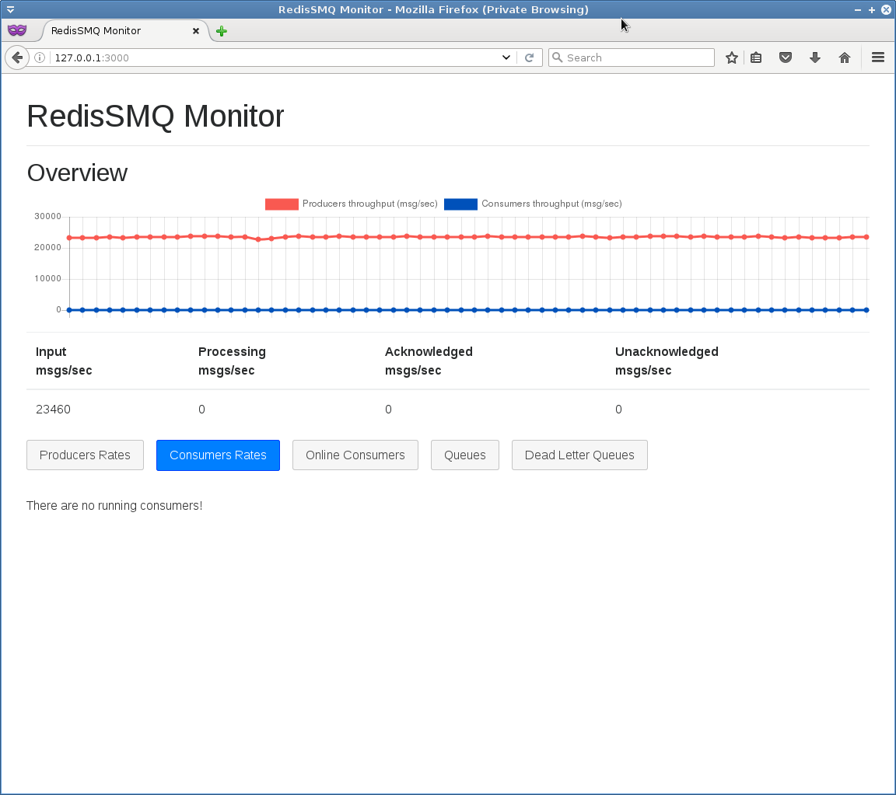
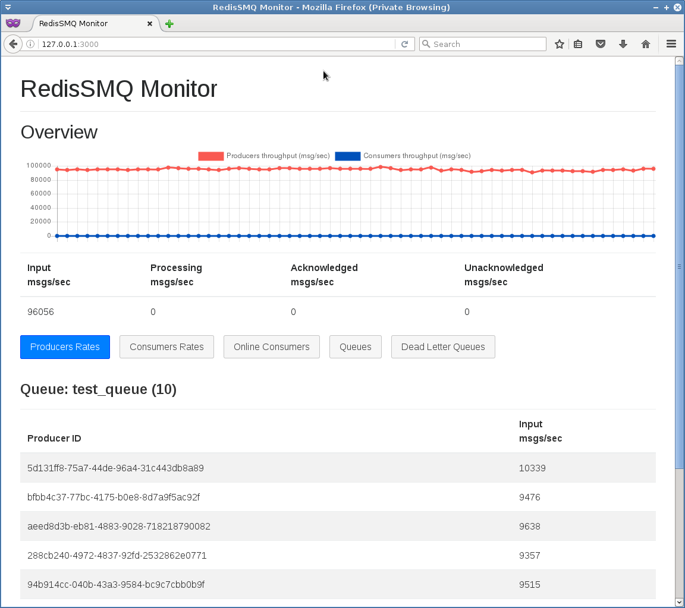
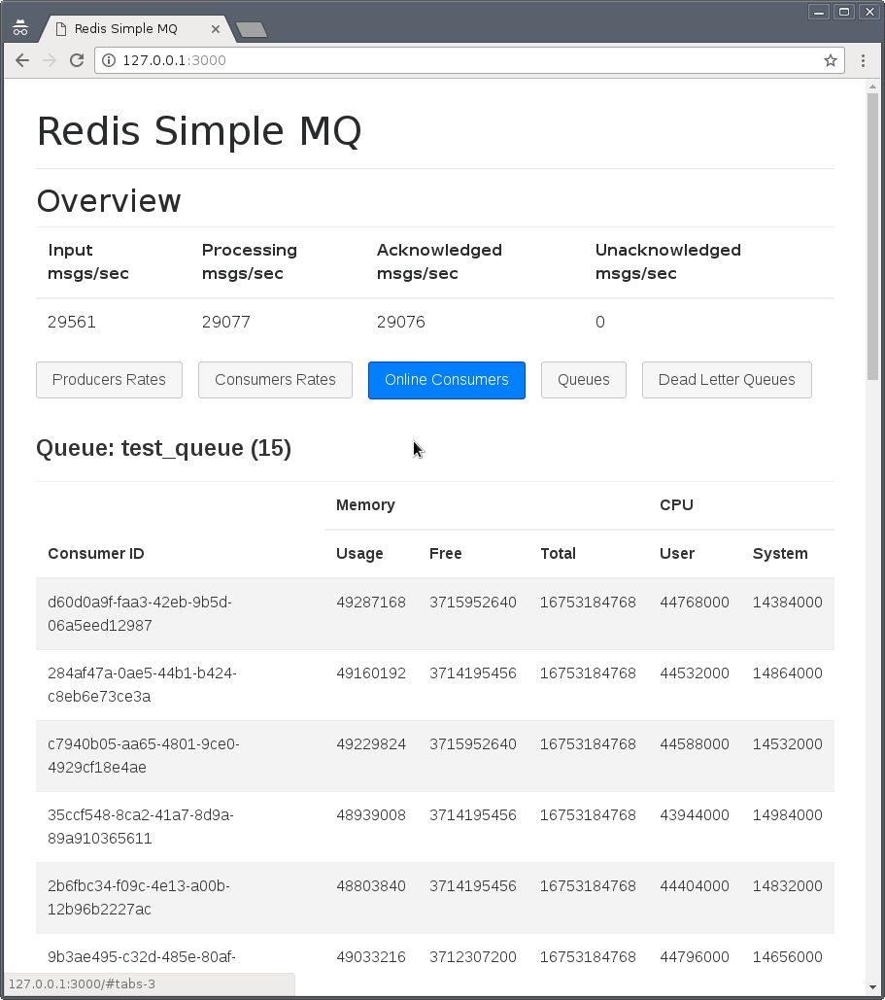
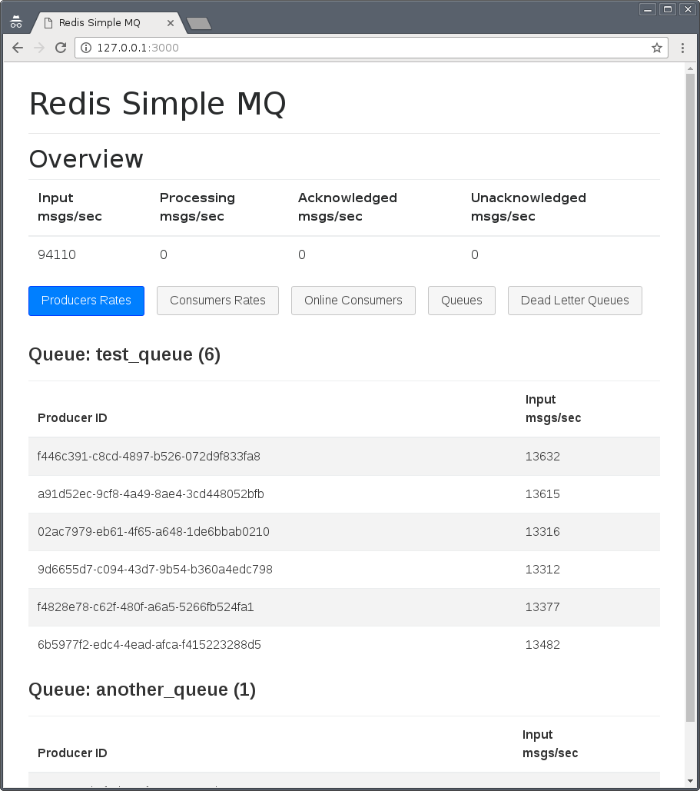
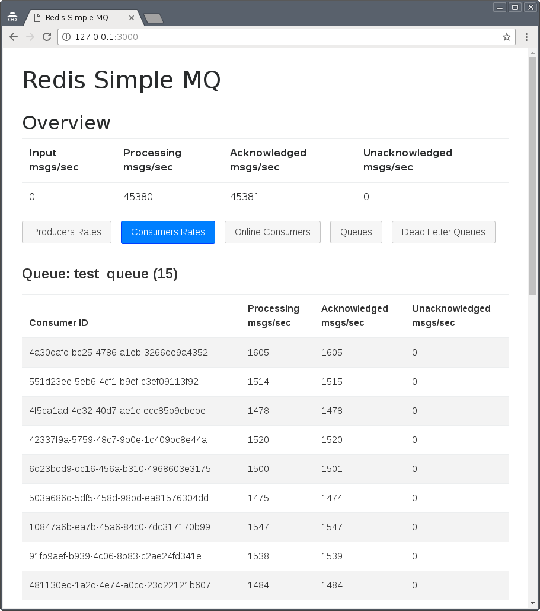
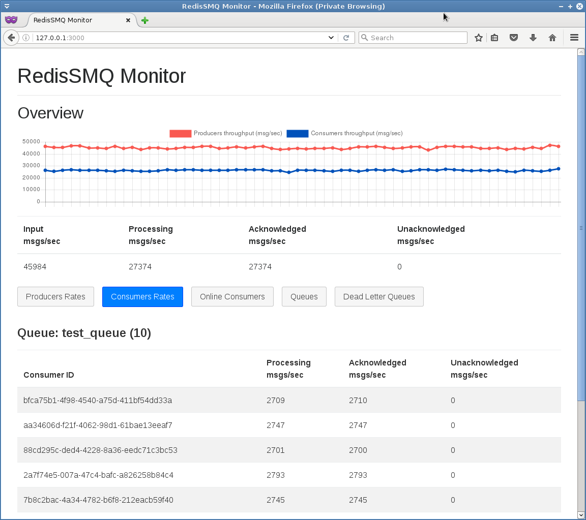
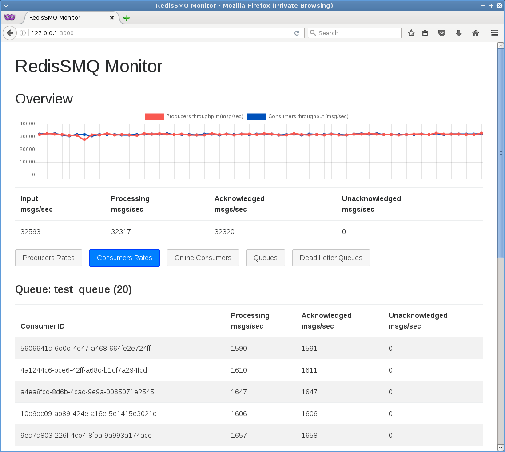

# RedisSMQ Monitor screenshots

Please note that the numbers shown in the screenshots are related to the Redis server configuration and the performance 
parameters of the host the server is running on!

## RedisSMQ running 1 producer instance:

## RedisSMQ running 10 producer instances:

## RedisSMQ running 1 consumer instance:

## RedisSMQ running 10 consumer instances:

## RedisSMQ running 1 consumer instance and 1 producer instance:

## RedisSMQ running 10 consumer instances and 10 producer instances:

## RedisSMQ running 10 producer instances and 20 consumer instances:

